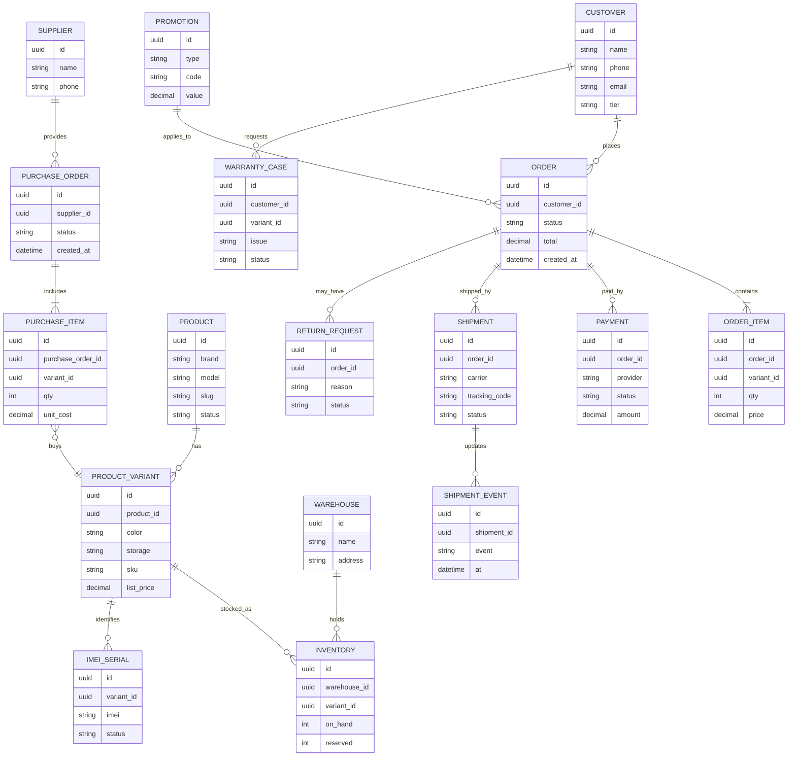
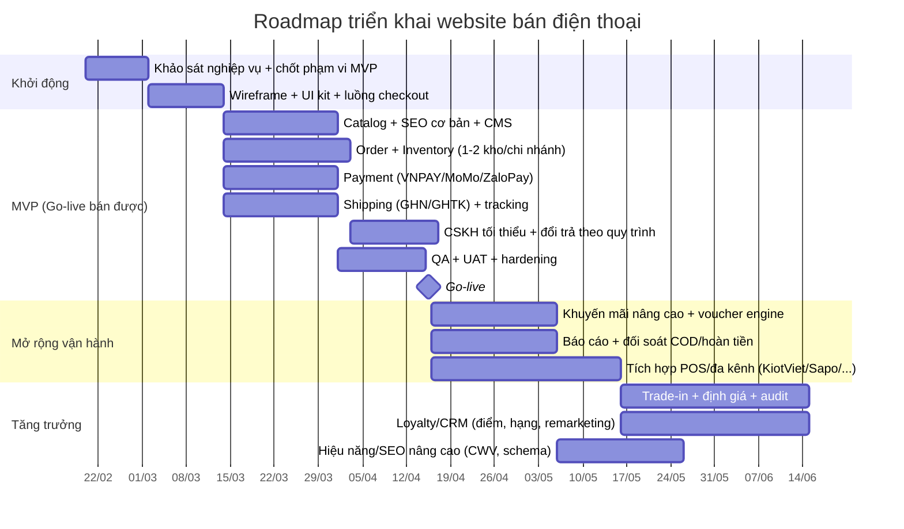

# Báo cáo kế hoạch xây dựng ứng dụng web chuyên bán điện thoại di động

## Tóm tắt điều hành

Thị trường thương mại điện tử Việt Nam đang ở giai đoạn tăng trưởng cao, với ước tính quy mô TMĐT năm 2024 đạt **~32 tỷ USD** và tăng trưởng **~27%**, trong đó doanh số bán lẻ hàng hóa trực tuyến đạt **~22,5 tỷ USD** (tăng **~30%**) theo báo cáo chỉ số TMĐT 2025 của entity["organization","VECOM","vietnam e-commerce assoc"]. citeturn37view1turn37view0 Trong bối cảnh đó, một website “chuyên bán điện thoại” cạnh tranh bền vững không thể chỉ là “đăng sản phẩm + nhận đơn”, mà phải vận hành như một hệ thống bán lẻ số: kiểm soát tồn kho theo chi nhánh, giá–khuyến mãi động, thanh toán–trả góp, giao nhận–đồng kiểm, bảo hành–đổi trả, và đặc biệt là khả năng bán đa kênh (website–cửa hàng–sàn). citeturn37view0turn23search0turn23search1

Qua khảo sát **13 nền tảng bán điện thoại thịnh hành** (trong nước và quốc tế), các điểm “ăn tiền” lặp lại là: (1) **niềm tin** (đồng kiểm/đổi trả minh bạch, tín hiệu “chính hãng”, chính sách bảo hành rõ), (2) **trả góp & pay-later** để tăng chuyển đổi ở phân khúc 7–30 triệu, (3) **logistics nhanh & theo dõi trạng thái chuẩn**, (4) **mobile-first + tối ưu SEO**, vì entity["company","Google","search engine company"] dùng nội dung phiên bản di động để lập chỉ mục/xếp hạng (mobile-first indexing) và khuyến nghị mạnh trải nghiệm di động tốt. citeturn25search0turn25search1

Về kỹ thuật, đề xuất triển khai theo hướng **kiến trúc mô-đun (modular)**, ưu tiên “ra được hệ thống chạy thật” cho người bán truyền thống:  
- Giai đoạn đầu: **một khối backend thống nhất** (modular monolith) để giảm chi phí và rủi ro, nhưng thiết kế sẵn ranh giới module để mở rộng về sau.  
- Tích hợp sớm các dịch vụ cốt lõi: cổng thanh toán (entity["company","VNPAY","payment gateway vietnam"], entity["company","MoMo","e-wallet vietnam"], entity["company","ZaloPay","e-wallet vietnam"], pay-later như entity["company","Kredivo","paylater southeast asia"]) và giao vận (entity["company","GHN","shipping carrier vietnam"], entity["company","Giao Hàng Tiết Kiệm","shipping carrier vietnam"]) vì đều có tài liệu tích hợp chuẩn (API/webhook). citeturn30search3turn30search11turn34search0turn34search1turn34search2turn30search0turn30search13turn30search8  
- Đặt tiêu chí **an toàn & tuân thủ** ngay từ MVP: theo **Nghị định 52/2013** (và sửa đổi **85/2021**) về TMĐT, **Nghị định 13/2023** về bảo vệ dữ liệu cá nhân, và Luật **19/2023/QH15** (hiệu lực 01/07/2024) về bảo vệ quyền lợi người tiêu dùng; đồng thời thực hiện thủ tục **thông báo website TMĐT bán hàng** qua cổng của entity["organization","Bộ Công Thương","vietnam ministry of industry and trade"]/entity["organization","Cục Thương mại điện tử và Kinh tế số","moit vietnam"]. citeturn23search0turn23search1turn23search2turn23search3turn24search0turn24search2

## Khảo sát các website bán điện thoại thịnh hành

Phạm vi khảo sát gồm: chuỗi bán lẻ chuyên điện thoại (VN), sàn TMĐT lớn (VN), và mô hình hãng bán trực tiếp / marketplace quốc tế. Kết quả nổi bật là “cùng bán điện thoại nhưng cách tạo niềm tin và cách vận hành rất khác”, kéo theo yêu cầu hệ thống khác nhau. citeturn10search0turn11search0turn37view0

### Bảng so sánh nhanh 13 website

| Website | Mô hình kinh doanh | Thanh toán & tài chính | Logistics / nhận hàng | Đổi trả / bảo hành (tóm tắt theo nguồn) | Tín hiệu tin cậy/bảo mật đáng chú ý |
|---|---|---|---|---|---|
| **entity["company","Thế Giới Di Động","electronics retailer vietnam"]** | Chuỗi bán lẻ + online (đặt qua web/điện thoại). citeturn10search0 | Thẻ nội địa/internet banking, thẻ quốc tế qua cổng thanh toán; có trang trả góp và “trả chậm”. citeturn10search4turn10search6turn10search2 | Có trang chính sách giao hàng riêng. citeturn10search1 | Có chính sách bảo hành/đổi trả/hoàn tiền theo tháng, kèm mức phí theo thời gian sử dụng. citeturn10search5 | Có chính sách bảo mật thông tin khách hàng. citeturn10search3 |
| **entity["company","FPT Shop","electronics retailer vietnam"]** | Chuỗi bán lẻ + online (hướng dẫn đặt mua/đặt hàng). citeturn11search0 | Có hướng dẫn mua & thanh toán; hỗ trợ thanh toán khi nhận hàng và qua thẻ (nguồn F.Studio by FPT). citeturn11search0turn11search4 | Chính sách giao hàng: đơn giá trị lớn có yêu cầu thanh toán trước 100% khi giao tại nhà. citeturn11search6turn11search14 | Quy trình bảo hành/đổi trả có đề cập trong điều khoản; chi tiết theo trang chính sách tương ứng (**không xác định** “cửa sổ đổi trả” nếu chỉ dựa trên nguồn đã thu thập). citeturn11search14 | Có chính sách thu thập & xử lý dữ liệu cá nhân. citeturn11search1 |
| **entity["company","CellphoneS","phone retailer vietnam"]** | Bán lẻ chuyên thiết bị số + hệ thành viên. citeturn12search2 | Hướng dẫn mua online: COD/chuyển khoản; tích hợp chuyển khoản VietQR; hỗ trợ trả góp qua thẻ và pay-later. citeturn12search5turn12search0turn12search4 | Chính sách giao hàng nêu rõ khung giờ; đơn giá trị cao có bước kiểm tra thẻ/CCCD, có OTP xác nhận cho đơn trả trước (chống gian lận). citeturn12search1 | **Không xác định** trong bộ nguồn hiện có về “cửa sổ đổi trả” chuẩn (cần thêm nguồn chính sách đổi trả chuyên biệt). | Có chính sách bảo mật. citeturn12search3 |
| **entity["company","Hoàng Hà Mobile","phone retailer vietnam"]** | Bán lẻ + đặt hàng online. citeturn13search7 | Nền tảng điều khoản nêu “chưa có thanh toán trực tuyến qua website”, hỗ trợ COD/chuyển khoản; đồng thời có hướng dẫn thanh toán online qua QR (thực chất là chuyển khoản QR). citeturn13search8turn13search3 | Có hướng dẫn đặt hàng & chính sách vận chuyển; điều khoản nêu **không hỗ trợ đồng kiểm**, chỉ kiểm tra ngoại quan. citeturn13search7turn13search5 | Có chính sách bảo hành/đổi trả, gồm cơ chế nhập lại trong 30 ngày với mức phí tối thiểu theo nhóm sản phẩm (ví dụ Apple). citeturn13search10 | Có chính sách bảo mật. citeturn13search2 |
| **entity["company","Di Động Việt","phone retailer vietnam"]** | Bán lẻ + dịch vụ trade-in. citeturn15search3 | Có quy trình “thanh toán trước online qua thẻ tín dụng” trong chính sách bán hàng; có trang/thuật ngữ trả góp qua công ty tài chính. citeturn15search0turn15search6 | Có chính sách kiểm hàng/đồng kiểm khi giao nhận tại nhà. citeturn15search8 | **Không xác định** về “cửa sổ đổi trả” tổng quát trong bộ nguồn hiện có (ngoài kiểm hàng & quy trình giao kết). | Chính sách bảo mật nêu dùng SSL bảo mật kết nối website. citeturn15search1 |
| **entity["company","Viettel Store","electronics retailer vietnam"]** | Bán lẻ đa ngành (điện thoại, laptop…) + online. citeturn14search12 | Trang phương thức thanh toán: VNPAY-QR, ATM/tài khoản NH, thẻ quốc tế; có trả góp qua cổng trung gian (nêu Alepay/Ngân Lượng). citeturn14search0turn14search1 | Chính sách giao hàng nêu SLA theo khoảng cách (ví dụ 10–20km có mốc phút giao hàng trong điều kiện cụ thể). citeturn1search9 | Có chính sách thu đổi/hoàn tiền theo khung (tóm tắt theo trang chính sách). citeturn1search17 | Có chính sách bảo mật / bảo vệ dữ liệu cá nhân. citeturn14search3turn14search7 |
| **entity["company","ShopDunk","apple authorized reseller vietnam"]** | Đại lý uỷ quyền Apple + online (có đặt cọc sản phẩm mới). citeturn16search13turn16search5 | Trang phương thức thanh toán liệt kê COD, chuyển khoản, thẻ nội địa/quốc tế, VNPAY, ZaloPay, OnePay, Payoo, Kredivo… citeturn16search0 | Trang giao hàng nêu hợp tác với Viettel Post để ship COD toàn quốc. citeturn16search1 | Có chính sách hủy giao dịch/hoàn tiền; chính sách bảo hành riêng (ví dụ “1 đổi 1” theo nhóm hàng). citeturn1search6turn1search10turn16search6 | Có chính sách bảo mật. citeturn16search2 |
| **entity["company","Tiki","ecommerce platform vietnam"]** | Marketplace + Tiki Trading; hỗ trợ logistics (TikiNOW). citeturn2search7 | Trang hỗ trợ nêu các phương thức thanh toán, gồm trả góp qua thẻ tín dụng 0% và “mua trước trả sau” (BNPL). citeturn9search0turn9search1turn9search7 | Cho phép mở niêm phong thùng hàng của Tiki để kiểm tra hàng hóa ở mức giới hạn (không bao gồm “mở seal” theo mô tả). citeturn9search5 | Có hướng dẫn tạo yêu cầu đổi trả trên app; có chính sách bảo hành (chính hãng hoặc qua Tiki). citeturn2search1turn2search2 | (Dòng tiền/hoàn tiền) có hướng dẫn thời gian hoàn tiền theo phương thức (bảng FAQ). citeturn9search12 |
| **entity["company","Lazada","ecommerce platform southeast asia"]** | Marketplace (LazMall, Choice…). citeturn8search23 | Có LazPayLater FAQ; có chương trình trả góp 0% theo thẻ tín dụng, kỳ hạn 3–12 tháng, điều kiện giá trị đơn và quy định không huỷ/đổi trả sau khi giao & chuyển đổi trả góp thành công. citeturn8search13turn29view2 | Trang thể lệ trả góp hiển thị hệ sinh thái “Delivery Services” gồm Lazada Logistics và các đối tác (ví dụ GHN, Ninja Van, Grab…). citeturn29view2 | Có thông tin cập nhật: thời gian đổi trả cho LazMall/Choice thay đổi từ 15 lên 30 ngày (theo trang hỗ trợ). citeturn8search22 | **Không xác định** trong bộ nguồn hiện có về “chi tiết thanh toán phổ biến” do trang helpcenter động không trích xuất được trong phiên nghiên cứu. |
| **entity["company","Shopee","ecommerce platform southeast asia"]** | Marketplace + cơ chế giữ tiền/giải quyết tranh chấp. citeturn28search9 | Có hệ ví entity["company","ShopeePay","e-wallet vietnam"]; trang hỗ trợ thanh toán ShopeePay nêu yêu cầu đăng ký & xác minh để thanh toán. citeturn3search10turn3search5 | **Không xác định** về cơ chế logistics chi tiết theo nguồn chính thức trong phiên này; (ghi nhận chung: marketplace dùng mạng lưới ĐVVC theo từng đơn). | Báo chí ghi nhận Shopee mở rộng “đổi ý 15 ngày” (2024) và sau đó siết phạm vi lý do “không còn nhu cầu” (từ 24/11/2025) chỉ cho nhóm khách hạng cao/VIP. citeturn3search0turn28search10turn6search8 | Cơ chế tranh chấp: khi có yêu cầu Return/Refund, Shopee có thể giữ tiền trả cho người bán đến khi tranh chấp kết thúc (bài phân tích pháp lý). citeturn28search9 |
| **entity["company","Apple Store Trực Tuyến","vietnam online store"]** | Hãng bán trực tiếp (D2C) + Trade In. citeturn17search1 | Trang trợ giúp “Thanh toán & bảo mật” và trang “Tài trợ” cho biết có lựa chọn trả góp qua MoMo và trả góp qua thẻ tín dụng (0% theo điều kiện). citeturn19search1turn19search0 | Trang giao hàng ghi khung giờ giao (T2–T7, 8:00–20:00) và có trang “giao ngày hôm sau” cho khu vực/điều kiện nhất định. citeturn19search2turn19search6 | Trang đổi trả/hoàn tiền nêu trường hợp sản phẩm lỗi có thể yêu cầu thay thế online trong 14 ngày đầu kể từ lúc nhận. citeturn17search0 | Chính sách quyền riêng tư được công bố riêng. citeturn19search3 |
| **entity["company","Samsung Online Store","vietnam online store"]** | Hãng bán trực tiếp (D2C) + thu cũ đổi mới. citeturn18search3 | Trang FAQ nêu chấp nhận thanh toán online (thẻ) và COD (trả tiền khi nhận hàng). citeturn20view2 | Trang hỗ trợ có mục giao hàng/lắp đặt (danh mục). citeturn20view3 | Trang “returns period” nêu: không chấp nhận huỷ do đổi ý; đồng ý hoàn trả trong 7 ngày nếu lỗi sản xuất hoặc giao sai mã/màu (kèm điều kiện phụ kiện). citeturn21view0 | Chương trình thu cũ/đổi mới và trả góp được mô tả trong FAQ. citeturn20view4turn18search3 |
| **entity["company","Amazon","global ecommerce marketplace"]** | Marketplace toàn cầu + dịch vụ Prime + hàng refurbished. citeturn22search0turn22search3 | Trang hỗ trợ thanh toán nêu chấp nhận nhiều phương thức (tối thiểu: credit/debit/gift card; tuỳ quốc gia có khác biệt). citeturn22search1 | Prime có tuỳ chọn giao nhanh (ví dụ Same‑Day theo điều kiện khu vực/đơn hàng đủ điều kiện). citeturn22search2turn22search10 | Chính sách đổi trả: “most items” hoàn tiền/đổi trong 30 ngày nếu đáp ứng điều kiện. citeturn17search3 | A‑to‑z Guarantee bảo vệ khi mua từ người bán bên thứ ba (tuỳ điều kiện). citeturn22search0 |

### Nhận định kiến trúc–sản phẩm rút ra từ khảo sát

Thứ nhất, **“bán điện thoại” là bài toán niềm tin + hậu mãi**, không chỉ là checkout. Những khác biệt như “cho đồng kiểm” (ví dụ Di Động Việt) hay “không đồng kiểm” (ví dụ Hoàng Hà) tạo khác biệt lớn trong khiếu nại/đổi trả và cần phản ánh thành **luồng nghiệp vụ** + **bằng chứng** trong hệ thống (ảnh/video mở kiện, OTP bàn giao, log trạng thái vận chuyển). citeturn15search8turn13search5turn12search1

Thứ hai, **trả góp & BNPL là đòn bẩy chuyển đổi**: Tiki đưa “trả góp 0% qua thẻ” và BNPL vào danh sách phương thức thanh toán; Apple công bố trả góp qua MoMo và qua thẻ tín dụng; Samsung và Lazada đều có chương trình trả góp/thu cũ đổi mới; CellphoneS và Viettel Store có nhiều kênh trả góp (thẻ/công ty tài chính/cổng). Điều này kéo theo yêu cầu hệ thống về: kiểm soát rủi ro đơn giá trị cao, đối soát phí, và xử lý huỷ/đổi theo điều khoản trả góp. citeturn9search0turn19search0turn20view4turn29view2turn12search0turn14search1

Thứ ba, logistics của các đơn vị lớn có xu hướng “chuẩn hoá SLA & trạng thái”. Ví dụ Viettel Store mô tả mốc giao theo khoảng cách; Apple mô tả khung giờ giao và tuỳ chọn giao nhanh theo khu vực/điều kiện; sàn như Lazada cho thấy hệ sinh thái đối tác giao vận; trong khi các nhà bán lẻ chuyên điện thoại bổ sung lớp chống gian lận (kiểm CCCD/thẻ, OTP nhận hàng). citeturn1search9turn19search2turn19search6turn29view2turn12search1

## Nhu cầu kinh doanh của người bán truyền thống

Trường hợp “người bán truyền thống” (có cửa hàng/nguồn hàng sẵn, quen chốt đơn trực tiếp) thường gặp 3 nhóm vấn đề khi chuyển sang web: **mất kiểm soát tồn kho**, **lẫn giá/khuyến mãi giữa các kênh**, và **khó đối soát tiền–phí vận chuyển–đổi trả**. Vì vậy, hệ thống cần ưu tiên “quản trị vận hành” trước khi chạy các tính năng nâng cao.

### Bảng tính năng nghiệp vụ đề xuất theo mức ưu tiên

| Nhóm chức năng | Cụ thể cần có cho bán điện thoại | MVP (bắt buộc) | Mở rộng giai đoạn sau |
|---|---|---:|---:|
| Sản phẩm & giá | Quản lý model–phiên bản (màu/dung lượng), SKU/serial/IMEI (tuỳ mức), giá bán theo chi nhánh, giá online riêng, giá sỉ (nếu có). | ✅ | ✅ (giá theo nhóm KH, dynamic pricing) |
| Tồn kho | Tồn theo chi nhánh/kho; cảnh báo cạn; đặt giữ hàng khi tạo đơn; kiểm kê; nhập hàng theo lô. | ✅ | ✅ (tối ưu phân bổ tồn, “ship-from-store”) |
| Đơn hàng | Tạo đơn, trạng thái chuẩn (mới–xác nhận–đóng gói–giao–hoàn tất–huỷ–hoàn), in phiếu, ghi chú, phân tuyến xử lý. | ✅ | ✅ (tự động hoá theo SLA) |
| Thanh toán | COD, chuyển khoản, thẻ/QR qua cổng; đối soát thanh toán; hoàn tiền. (Tích hợp cổng: VNPAY/MoMo/ZaloPay/BNPL). citeturn30search3turn34search0turn34search1turn34search2turn34search3 | ✅ | ✅ (split payment, chống gian lận nâng cao) |
| Giao vận | Tính phí ship, tạo vận đơn, tracking, webhook cập nhật trạng thái, đổi COD; đối soát COD. citeturn30search0turn30search4turn30search8turn30search13 | ✅ | ✅ (đa ĐVVC, tối ưu tuyến) |
| Khuyến mãi | Voucher, giảm giá theo model, quà tặng kèm, combo phụ kiện, flash sale theo khung giờ. | ✅ (mức cơ bản) | ✅ (rule engine) |
| Thu cũ đổi mới | Nhận thông tin máy cũ, định giá, bù trừ vào đơn hàng mới; audit theo tình trạng máy. (Nhiều bên coi trade-in là USP). citeturn17search1turn18search3turn15search3 | ⭕ (tuỳ chiến lược) | ✅ |
| CSKH & bảo hành | Ticket khiếu nại, lịch sử bảo hành, điều kiện đổi trả, lưu bằng chứng. (Tác động mạnh niềm tin). citeturn21view0turn2search2 | ✅ (tối thiểu) | ✅ |
| Đa kênh & POS | Đồng bộ với POS/ERP hoặc phần mềm bán hàng phổ biến; ít nhất phải đồng bộ sản phẩm–tồn–đơn. citeturn33search4turn33search5turn33search2 | ⭕ | ✅ |
| Nhà cung cấp | Danh sách NCC, giá nhập theo lô, công nợ, lịch sử mua. | ✅ (cơ bản) | ✅ (tối ưu mua hàng) |
| Báo cáo | Doanh thu, lợi nhuận gộp, tồn kho, tỷ lệ huỷ/hoàn, hiệu quả khuyến mãi, top sản phẩm. | ✅ | ✅ (BI nâng cao) |

Về tích hợp POS/đa kênh: nếu anh/chị đang dùng phần mềm như entity["company","KiotViet","pos software vietnam"], có thể tận dụng Public API để đọc/ghi hàng hoá–đơn hàng–khách hàng (giảm rủi ro “đập đi làm lại” hệ thống cửa hàng). citeturn33search4turn33search12 Nếu dùng entity["company","Sapo","commerce platform vietnam"] hoặc entity["company","Haravan","commerce platform vietnam"], cũng có nền tảng API/Webhook để đồng bộ đơn. citeturn33search5turn33search2

## Personas và hành vi mua

Hành vi mua điện thoại online thường đi theo “so sánh nhiều – cần yên tâm chính hãng – sợ rủi ro đổi trả”. Vì vậy, website phải hỗ trợ **ra quyết định nhanh trên mobile**, và giảm “nỗi sợ” bằng tín hiệu chính sách rõ ràng. citeturn25search0turn3search0turn21view0

### Bảng persona mục tiêu và hệ quả thiết kế

| Persona | Mục tiêu | Hành vi điển hình | “Nút bấm chốt đơn” | Rủi ro / rào cản cần xử lý bằng hệ thống |
|---|---|---|---|---|
| Người mua “giá tốt” | Giá thấp + khuyến mãi rõ + trả góp | So sánh nhiều trang, săn voucher/flash sale | Voucher + trả góp 0%/BNPL | Tranh chấp đổi trả; cần chính sách & ticket rõ (giống xu hướng “đổi ý” trên sàn). citeturn3search0turn28search10 |
| Người mua “chính hãng” | Máy chuẩn VN/A, bảo hành rõ | Đọc kỹ bảo hành/đổi trả | Cam kết bảo hành + đồng kiểm | Nếu không đồng kiểm, tăng nghi ngờ; cần luồng nhận hàng có OTP/bằng chứng. citeturn13search5turn12search1 |
| Người mua “cần gấp” | Nhận nhanh, gần cửa hàng | Chọn giao nhanh / nhận tại cửa hàng | SLA giao nhanh / click&collect | Phải có tồn kho theo chi nhánh và “giữ hàng” theo thời gian. citeturn1search9turn19search6 |
| Người mua “đổi máy” | Trade-in + bù tiền | Hỏi định giá máy cũ, muốn minh bạch | Định giá rõ + bù trừ tại checkout | Cần module trade‑in, audit tình trạng, chống gian lận. citeturn17search1turn18search3turn15search3 |
| Khách doanh nghiệp nhỏ | Mua số lượng + xuất hoá đơn | Mua lặp theo tháng, cần công nợ/giảm giá | Báo giá + hoá đơn + giao đúng hẹn | Cần price list theo khách, quản lý NCC, báo cáo công nợ (giai đoạn mở rộng). |

## Kiến trúc phần mềm đề xuất

Mục tiêu kiến trúc là: **dễ vận hành**, **dễ mở rộng**, và **tối ưu rủi ro** cho nhà bán truyền thống. Vì vậy, đề xuất kiến trúc “một hệ thống – nhiều module”, tích hợp qua API/webhook với thanh toán–giao vận–POS, và tối ưu mobile-first/SEO.

### Sơ đồ tổng quan hệ thống và luồng dữ liệu

```mermaid
flowchart LR
  subgraph Client
    W[Web storefront (mobile-first)]
    A[Admin/Backoffice]
  end

  CDN[CDN + WAF + Cache]
  W --> CDN
  A --> CDN

  CDN --> FE[Web App / SSR Layer]
  FE --> APIGW[API Gateway]

  subgraph Core
    AUTH[Auth & Customer]
    CAT[Catalog & Search]
    PRC[Pricing & Promotion]
    INV[Inventory]
    ORD[Order]
    PAY[Payment Orchestration]
    SHIP[Shipping Orchestration]
    CS[Customer Service & Warranty/Returns]
    CMS[Content/SEO CMS]
    RPT[Reporting]
  end

  APIGW --> AUTH
  APIGW --> CAT
  APIGW --> PRC
  APIGW --> INV
  APIGW --> ORD
  APIGW --> PAY
  APIGW --> SHIP
  APIGW --> CS
  APIGW --> CMS
  APIGW --> RPT

  subgraph Data
    DB[(PostgreSQL)]
    REDIS[(Redis Cache)]
    OBJ[(Object Storage: invoices/images)]
    MQ[(Queue/Event Bus)]
    LOG[(Logs/Tracing)]
  end

  AUTH --> DB
  CAT --> DB
  PRC --> DB
  INV --> DB
  ORD --> DB
  CS --> DB
  CMS --> DB
  RPT --> DB

  CAT --> REDIS
  FE --> REDIS
  ORD --> MQ
  PAY --> MQ
  SHIP --> MQ
  CS --> MQ

  subgraph Integrations
    PG[VNPAY / MoMo / ZaloPay / NAPAS / Kredivo]
    CV[GHN / GHTK]
    POS[POS/Omnichannel (KiotViet/Sapo/Haravan)]
  end

  PAY <--> PG
  SHIP <--> CV
  INV <--> POS
  ORD <--> POS
```

Các tích hợp được ưu tiên theo chuẩn tài liệu chính thức: VNPAY có tài liệu sandbox và mô hình kết nối merchant; MoMo/ZaloPay/Kredivo có hướng dẫn tích hợp và luồng callback; GHN/GHTK có API tạo đơn, cập nhật COD và webhook đồng bộ trạng thái. citeturn30search3turn30search11turn34search0turn34search1turn34search2turn30search0turn30search13turn30search8

### ERD tối thiểu cho bài toán bán điện thoại



Thiết kế này hỗ trợ cả bán mới và bài toán “máy theo IMEI/serial” (quan trọng khi bán điện thoại và xử lý bảo hành/đổi trả), đồng thời đủ mở để tích hợp POS/đa chi nhánh giai đoạn 2–3.

### API mức khung

- Public storefront: `/products`, `/products/{slug}`, `/search`, `/cart`, `/checkout`, `/orders/{id}`  
- Admin/backoffice: `/admin/products`, `/admin/inventory`, `/admin/orders`, `/admin/promotions`, `/admin/purchases`, `/admin/reports`  
- Integrations:  
  - Payment webhook: `/webhooks/payment/{provider}` (VNPAY/MoMo/ZaloPay/BNPL) citeturn34search0turn34search1turn30search3  
  - Shipping webhook: `/webhooks/shipping/{carrier}` (GHN/GHTK) citeturn30search8turn30search13  

## Yêu cầu phi chức năng và tuân thủ

Về SEO & mobile-first: do mobile-first indexing, phiên bản di động quyết định nhiều đến khả năng hiển thị tìm kiếm; đồng thời hiệu năng cần theo Core Web Vitals (LCP, INP, CLS) để tối ưu trải nghiệm và phù hợp khuyến nghị của Google. citeturn25search0turn25search1turn25search5turn25search13 Website bán điện thoại nên triển khai dữ liệu có cấu trúc cho trang sản phẩm (giá, tồn, đánh giá…) để tăng khả năng hiển thị rich results. citeturn25search2 Robots.txt và sitemap phải đúng chuẩn để quản lý crawl và submit lên Search Console. citeturn25search3turn25search7

Về bảo mật: hệ thống phải bám sát các rủi ro phổ biến của web/app và API theo entity["organization","OWASP","web security nonprofit"] (Top 10 Web 2021/2025) và OWASP API Security Top 10 2023 (đặc biệt nhóm lỗi phân quyền/tiết lộ dữ liệu quá mức). citeturn26search4turn26search0turn26search1 Các biện pháp chống gian lận nên học từ thực tế thị trường: xác minh CCCD/chủ thẻ cho đơn giá trị cao, OTP nhận hàng hoặc đối soát trước khi giao. citeturn12search1

Về định danh nâng cao: nếu hướng tới trải nghiệm đăng nhập “ít ma sát nhưng an toàn”, có thể triển khai passkeys theo chuẩn WebAuthn của entity["organization","W3C","web standards body"] và tham khảo hướng dẫn định danh số của entity["organization","NIST","us standards institute"] (SP 800-63-4). citeturn27search3turn27search12

Về thanh toán thẻ: nếu tự lưu/xử lý dữ liệu thẻ sẽ kéo theo gánh nặng tuân thủ PCI DSS; vì vậy kiến nghị **uỷ thác xử lý thẻ cho cổng thanh toán** và chỉ lưu token/metadata ở hệ thống nội bộ. PCI SSC công bố bộ tài liệu PCI DSS v4.x trong thư viện chuẩn. citeturn26search2turn26search6

Về pháp lý tại Việt Nam, tối thiểu cần đảm bảo:
- Khung TMĐT theo Nghị định 52/2013/NĐ-CP và các sửa đổi tại Nghị định 85/2021/NĐ-CP. citeturn23search0turn23search1  
- Bảo vệ dữ liệu cá nhân theo Nghị định 13/2023/NĐ-CP (quyền chủ thể dữ liệu, nghĩa vụ bảo vệ, nhật ký xử lý…). citeturn23search2turn23search10  
- Quyền lợi người tiêu dùng theo Luật 19/2023/QH15 (hiệu lực 01/07/2024). citeturn23search3  
- Thủ tục **thông báo website TMĐT bán hàng** trên cổng online.gov (hướng dẫn quy trình) và các quy định quản lý website TMĐT theo Thông tư 47/2014/TT-BCT. citeturn24search0turn24search2turn24search1  

## Roadmap triển khai, QA, DevOps, vận hành và marketing

### Roadmap theo giai đoạn và mốc bàn giao



Các hạng mục SEO trong roadmap (schema sản phẩm, sitemap, robots) bám theo tài liệu chính thức của Google Search Central. citeturn25search2turn25search7turn25search3turn25search0

### Bảng ước tính nhân lực, thời gian, chi phí

Các con số dưới đây là **ước tính nội bộ tham khảo** (không có nguồn công khai), dựa trên triển khai theo mô hình “mua dịch vụ tích hợp + xây phần lõi” (không tự xây cổng thanh toán/giao vận). Chi phí thực tế phụ thuộc phạm vi, chất lượng UI, mức độ tích hợp POS/ERP, và yêu cầu bảo mật/tuân thủ.

| Phương án | Thời gian đến Go‑live | Nhân sự lõi (FTE trung bình) | Phạm vi | Chi phí dev (ước tính) | Chi phí vận hành/tháng (ước tính) |
|---|---:|---:|---|---:|---:|
| Thấp (MVP tinh gọn) | 8–10 tuần | 4–6 | Catalog, đơn hàng, tồn kho cơ bản, 2 payment, 1–2 carrier, SEO cơ bản | 450–900 triệu VNĐ | 15–40 triệu VNĐ |
| Trung (vận hành ổn định) | 12–16 tuần | 6–9 | Thêm khuyến mãi nâng cao, đối soát, CSKH/bảo hành tốt hơn, chuẩn hoá quy trình đổi trả | 900 triệu–1,8 tỷ VNĐ | 30–80 triệu VNĐ |
| Bão hoà (chuỗi + đa kênh) | 6–9 tháng | 10–14 | POS/đa kênh, trade-in, loyalty/CRM, BI, tối ưu hiệu năng, phân quyền sâu | 2,5–6 tỷ VNĐ | 80–250 triệu VNĐ |

### QA, DevOps và vận hành

Về QA: với đặc thù điện thoại là mặt hàng giá trị cao, cần ưu tiên test “điểm rơi rủi ro”: checkout, trả góp/BNPL, hoàn tiền, webhook giao vận, và luồng đổi trả (bằng chứng). Các chính sách đổi trả của nhiều bên cho thấy “đổi ý/đổi trả” có thể thay đổi theo thời gian và theo nhóm khách hàng (đặc biệt trên sàn), nên hệ thống CSKH phải cấu hình được quy tắc theo gói/nhóm khách. citeturn3search0turn28search10turn29view2turn21view0

Về DevOps & vận hành: tối thiểu phải có CI/CD, logging/tracing, sao lưu định kỳ (DB + object storage), và cơ chế rollback. Về bảo mật vận hành, cấu hình WAF/rate limit và review lỗ hổng định kỳ theo hướng dẫn OWASP là yêu cầu nền. citeturn26search0turn26search1

### Chiến lược ra mắt & marketing cơ bản

Giai đoạn ra mắt nên ưu tiên “tăng niềm tin” trước “đốt quảng cáo”:
- SEO nền (mobile-first, Core Web Vitals), sitemap/robots, schema sản phẩm để hiển thị giá/tồn/đánh giá. citeturn25search0turn25search1turn25search2turn25search7turn25search3  
- Nội dung “hậu mãi”: trang bảo hành/đổi trả minh bạch (học từ Apple/Samsung/Tiki và các chuỗi lớn), landing page trade‑in nếu chọn chiến lược đổi máy. citeturn17search0turn21view0turn2search2turn17search1turn18search3  
- Vận hành khuyến mãi có kiểm soát: voucher theo điều kiện, chống lạm dụng đổi trả (bài học từ các biến động chính sách đổi ý trên sàn). citeturn28search10turn29view2  

Nếu có hạng mục nào anh/chị muốn ưu tiên theo thực tế cửa hàng (ví dụ: “tồn kho theo IMEI ngay từ đầu” hay “chỉ cần tồn theo số lượng”), phần kiến trúc và roadmap ở trên có thể điều chỉnh mà không phá vỡ thiết kế nền.