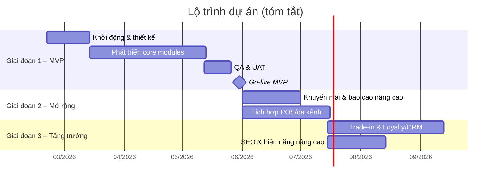

# Executive Summary – Ứng dụng Web Bán Điện Thoại

**Phiên bản:** 1.0.0  
**Ngày:** 2026-02-19  
**Đối tượng:** Ban lãnh đạo, nhà đầu tư  

---

## Tóm tắt

Thị trường thương mại điện tử Việt Nam năm 2024 đạt quy mô ước tính **~32 tỷ USD** (tăng trưởng ~27%), trong đó doanh số bán lẻ hàng hóa trực tuyến đạt **~22,5 tỷ USD**. Điện thoại di động là một trong những ngành hàng có giá trị giao dịch cao nhất trên các kênh online.

Dự án này nhằm xây dựng **ứng dụng web thương mại điện tử chuyên bán điện thoại di động** – vận hành như một hệ thống bán lẻ số hoàn chỉnh: kiểm soát tồn kho, quản lý giá và khuyến mãi, xử lý thanh toán và trả góp, theo dõi giao vận, hậu mãi và bảo hành. Hệ thống được thiết kế theo chuẩn quốc tế, tối ưu mobile-first và SEO, tuân thủ pháp luật Việt Nam.

---

## Bối cảnh & Cơ hội

### Thị trường
- Thị trường TMĐT Việt Nam tăng trưởng mạnh, người tiêu dùng ngày càng ưa mua điện thoại online
- Kênh online giúp doanh nghiệp tiếp cận khách hàng vượt phạm vi địa lý cửa hàng vật lý
- Các đối thủ lớn (TGDĐ, FPT Shop, CellphoneS) đã có nền tảng online mạnh – cơ hội cho nhà bán chuyên sâu, dịch vụ tốt

### Thách thức
- Niềm tin là yếu tố then chốt: khách hàng cần chính sách bảo hành/đổi trả minh bạch, đồng kiểm khi nhận hàng
- Trả góp & BNPL là đòn bẩy chuyển đổi quan trọng cho đơn hàng 7–30 triệu VNĐ
- Quản lý tồn kho theo IMEI/serial đòi hỏi hệ thống chuyên biệt

---

## Giải pháp đề xuất

Triển khai hệ thống web theo kiến trúc **modular monolith** với 10 module nghiệp vụ:

| Module | Mô tả |
|---|---|
| Auth & Customer | Đăng ký/đăng nhập, phân quyền, quản lý hồ sơ |
| Catalog & Search | Sản phẩm, biến thể, tìm kiếm, SEO |
| Pricing & Promotion | Giá động, voucher, flash sale |
| Inventory | Tồn kho đa kho, IMEI/serial |
| Order | Quản lý đơn hàng end-to-end |
| Payment | VNPAY, MoMo, ZaloPay, Kredivo |
| Shipping | GHN, GHTK, tracking, COD |
| Customer Service | Ticket, bảo hành, đổi trả |
| CMS | Nội dung, SEO, banner |
| Reporting | Doanh thu, tồn kho, báo cáo vận hành |

---

## Lộ trình triển khai

---

## Ngân sách & Nguồn lực

| Phương án | Thời gian | Nhân sự (FTE) | Chi phí phát triển | Chi phí vận hành/tháng |
|---|---|---|---|---|
| MVP tinh gọn | 8–10 tuần | 4–6 | 450–900 triệu VNĐ | 15–40 triệu VNĐ |
| **Trung bình (khuyến nghị)** | **12–16 tuần** | **6–9** | **900 triệu–1,8 tỷ VNĐ** | **30–80 triệu VNĐ** |
| Bão hoà (chuỗi/đa kênh) | 6–9 tháng | 10–14 | 2,5–6 tỷ VNĐ | 80–250 triệu VNĐ |

**Khuyến nghị:** Bắt đầu với phương án trung bình, đảm bảo vận hành ổn định trước khi mở rộng sang đa kênh và trade-in.

---

## ROI dự kiến

- **Break-even:** Dự kiến đạt trong 18–24 tháng sau Go-live (tùy quy mô doanh số)
- **Lợi ích trực tiếp:** Tăng doanh thu kênh online, tiết kiệm chi phí nhân sự xử lý đơn thủ công
- **Lợi ích gián tiếp:** Nâng cao hình ảnh thương hiệu, mở rộng tệp khách hàng, dữ liệu phân tích kinh doanh

---

## Rủi ro & Biện pháp

| Rủi ro | Biện pháp |
|---|---|
| Trễ tích hợp đối tác thanh toán | Đăng ký hợp đồng với cổng thanh toán từ tuần 1 |
| Compliance pháp lý | Tư vấn pháp lý song song với phát triển |
| Bảo mật dữ liệu | Kiểm tra OWASP, PCI DSS tokenization trước Go-live |

---

## Kiến nghị

Đề nghị ban lãnh đạo **phê duyệt triển khai phương án trung bình** (900 triệu – 1,8 tỷ VNĐ, 12–16 tuần) để đảm bảo:
1. Ra mắt đủ tính năng cốt lõi, cạnh tranh được với các nhà bán lẻ điện thoại online hiện tại
2. Hệ thống vận hành ổn định, tuân thủ pháp lý ngay từ ngày đầu
3. Nền tảng mở rộng tốt cho giai đoạn 2 và 3

*Xem chi tiết phân tích lợi ích kinh doanh tại [Business Case](business-case.md).*
