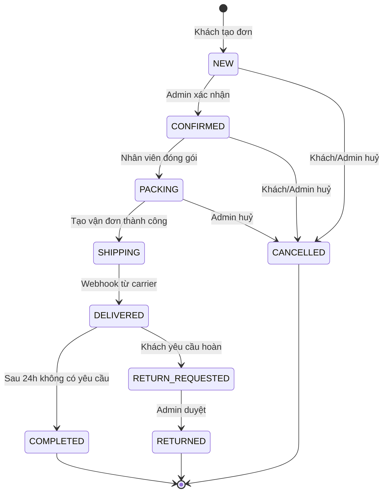
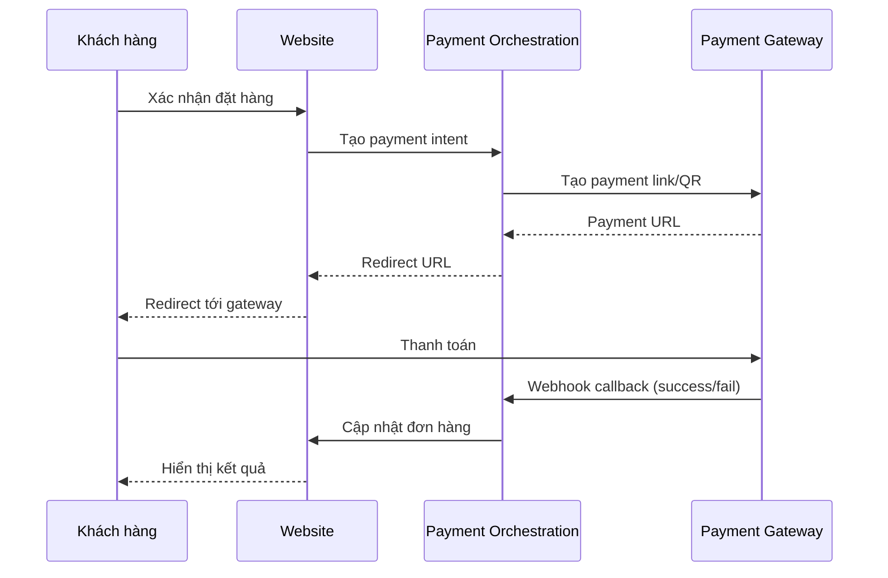

# Functional Requirements Specification (FRS)

**Phiên bản:** 1.1.0  
**Ngày:** 2026-02-19  
**Chuẩn tham chiếu:** ISO/IEC/IEEE 29148:2018  

## 1. Module AUTH – Xác thực & Phân quyền

### 1.1 Use Cases

| UC ID | Use Case | Actor | Mô tả |
|---|---|---|---|
| UC-AUTH-01 | Đăng ký tài khoản | Khách hàng | Luồng MVP: (1) Nhập phone + password + name → `POST /auth/register`; (2) Nhận OTP SMS; (3) Xác thực OTP → `POST /auth/verify-otp`; (4) Tài khoản được kích hoạt. *(Phase 2: hỗ trợ email)* |
| UC-AUTH-02 | Đăng nhập | Khách hàng, Admin | Đăng nhập phone/password *(MVP); Phase 2: email/password, Google OAuth* |
| UC-AUTH-03 | Quên mật khẩu | Khách hàng | Reset password qua OTP SMS gửi tới số điện thoại *(MVP); Phase 2: qua email* |
| UC-AUTH-04 | Phân quyền admin | Admin | Roles: Super Admin, Manager, Staff, Warehouse |
| UC-AUTH-05 | Quản lý phiên | Hệ thống | JWT access token (15 phút) + refresh token (30 ngày) |

### 1.2 Business Rules
- **AUTH-BR-01:** Mật khẩu phải có ít nhất 8 ký tự, bao gồm chữ hoa, chữ thường, và số
- **AUTH-BR-02:** Khóa tài khoản sau 5 lần đăng nhập sai liên tiếp trong vòng 15 phút
- **AUTH-BR-03:** Admin có thể kích hoạt/vô hiệu hóa tài khoản khách hàng
- **AUTH-BR-04:** Super Admin có thể cấp/thu hồi quyền cho Staff/Warehouse

### 1.3 Acceptance Criteria
- [ ] Khách hàng đăng ký thành công với số điện thoại VN (định dạng 0xxx xxxxxxx)
- [ ] OTP xác thực có thời hạn 5 phút
- [ ] Staff không thể truy cập tính năng quản lý nhân viên (chỉ Super Admin/Manager)

---

## 2. Module CATALOG – Sản phẩm & Tìm kiếm

### 2.1 Use Cases

| UC ID | Use Case | Actor | Mô tả |
|---|---|---|---|
| UC-CAT-01 | Tạo/sửa sản phẩm | Admin | Quản lý product + variants + attributes |
| UC-CAT-02 | Quản lý hình ảnh | Admin | Upload, sắp xếp thứ tự, đặt ảnh đại diện |
| UC-CAT-03 | Tìm kiếm sản phẩm | Khách hàng | Full-text search với filter (brand, price, storage) |
| UC-CAT-04 | Xem chi tiết sản phẩm | Khách hàng | Trang product detail với specs, ảnh, giá, tồn |
| UC-CAT-05 | Quản lý danh mục | Admin | Tạo cây danh mục, gán sản phẩm vào danh mục |
| UC-CAT-06 | SEO metadata | Admin | Quản lý title, meta description, slug, schema |

### 2.2 Cấu trúc dữ liệu sản phẩm

```
Product
├── id, brand, model, slug, description, status
├── categories[] (many-to-many)
├── images[]
├── specs (JSON: screen_size, battery, camera...)
└── variants[]
    ├── id, color, storage, sku, list_price, sale_price
    ├── images[]
    └── imei_serials[] (optional, per unit)
```

### 2.3 Business Rules
- **CAT-BR-01:** Slug phải duy nhất trong toàn hệ thống, auto-generate từ tên model
- **CAT-BR-02:** Sản phẩm chỉ hiển thị trên storefront khi status = "active" và có ít nhất 1 variant
- **CAT-BR-03:** Khi tồn kho = 0, hiển thị "Hết hàng" và tắt nút "Thêm vào giỏ"
- **CAT-BR-04:** Hỗ trợ đa ngôn ngữ cho SEO metadata (tiếng Việt là chính)

### 2.4 Acceptance Criteria
- [ ] Tìm kiếm "iPhone 15 Pro 256GB" trả về kết quả trong < 500ms
- [ ] Filter sản phẩm theo brand/price/storage hoạt động chính xác
- [ ] Trang sản phẩm render đúng structured data schema.org/Product

---

## 3. Module PRICING – Giá & Khuyến mãi

### 3.1 Use Cases

| UC ID | Use Case | Actor | Mô tả |
|---|---|---|---|
| UC-PRC-01 | Tạo sale price | Admin | Đặt giá sale cho variant trong khoảng thời gian |
| UC-PRC-02 | Tạo voucher | Admin | Voucher theo %, số tiền cố định, điều kiện áp dụng |
| UC-PRC-03 | Áp voucher | Khách hàng | Nhập mã voucher tại giỏ hàng/checkout |
| UC-PRC-04 | Flash sale | Admin | Thiết lập flash sale theo khung giờ (giai đoạn 2) |
| UC-PRC-05 | Quà tặng kèm | Admin | Cấu hình quà tặng theo điều kiện đơn hàng (giai đoạn 2) |

### 3.2 Business Rules
- **PRC-BR-01:** Một đơn hàng chỉ áp dụng được 1 voucher tại một thời điểm
- **PRC-BR-02:** Voucher có thể giới hạn: số lần dùng tổng, số lần/khách hàng, thời hạn, giá trị đơn tối thiểu
- **PRC-BR-03:** Giá hiển thị luôn là giá sau khi áp sale price (nếu có)
- **PRC-BR-04:** Flash sale tự động bắt đầu/kết thúc theo thời gian đã cài đặt

---

## 4. Module INVENTORY – Tồn kho

### 4.1 Use Cases

| UC ID | Use Case | Actor | Mô tả |
|---|---|---|---|
| UC-INV-01 | Xem tồn kho | Admin | Xem tồn theo warehouse và variant |
| UC-INV-02 | Điều chỉnh tồn kho | Admin | Nhập/xuất kho thủ công với lý do |
| UC-INV-03 | Nhập hàng từ PO | Admin | Tạo Purchase Order và nhận hàng cập nhật tồn |
| UC-INV-04 | Cảnh báo tồn thấp | Hệ thống | Gửi notification khi tồn < ngưỡng cài đặt |
| UC-INV-05 | Quản lý IMEI | Admin | Thêm, tra cứu, cập nhật trạng thái IMEI/serial |

### 4.2 Business Rules
- **INV-BR-01:** `available = on_hand - reserved`; không cho phép available < 0
- **INV-BR-02:** Khi tạo đơn hàng, reserved tăng lên; khi đơn Hoàn tất/Huỷ, reserved giảm (hoàn lại nếu Huỷ)
- **INV-BR-03:** IMEI phải duy nhất toàn hệ thống; 1 IMEI chỉ thuộc 1 variant
- **INV-BR-04:** Mọi thay đổi tồn kho phải có log với timestamp, user, lý do

---

## 5. Module ORDER – Đơn hàng

### 5.1 Luồng trạng thái đơn hàng



### 5.2 Business Rules
- **ORD-BR-01:** Đơn hàng phải có ít nhất 1 sản phẩm, địa chỉ giao hàng, và phương thức thanh toán
- **ORD-BR-02:** Chỉ Admin/Manager mới có thể huỷ đơn sau trạng thái CONFIRMED
- **ORD-BR-03:** Sau trạng thái PACKING, tồn kho thực (on_hand) mới giảm khi tạo vận đơn
- **ORD-BR-04:** Đơn COD: tiền phải được đối soát trong 7 ngày từ ngày giao thành công
- **ORD-BR-05:** Mỗi thay đổi trạng thái gửi email/SMS thông báo cho khách hàng

### 5.3 Acceptance Criteria
- [ ] Tạo đơn thành công và nhận email xác nhận trong < 60 giây
- [ ] Trạng thái đơn cập nhật chính xác khi webhook nhận từ carrier
- [ ] Lịch sử trạng thái đầy đủ với timestamp

---

## 6. Module PAYMENT – Thanh toán

### 6.1 Luồng thanh toán online (VNPAY/MoMo/ZaloPay)



### 6.2 Business Rules
- **PAY-BR-01:** Payment link hết hạn sau 15 phút
- **PAY-BR-02:** Webhook phải được xác thực bằng chữ ký số (HMAC-SHA256) từ cổng thanh toán
- **PAY-BR-03:** Không được ghi nhận thanh toán thành công trước khi xác minh webhook
- **PAY-BR-04:** Hoàn tiền phải được thực hiện trong 7 ngày làm việc từ ngày yêu cầu
- **PAY-BR-05:** Mỗi giao dịch phải có reference ID duy nhất để đối soát

---

## 7. Module SHIPPING – Giao vận

### 7.1 Use Cases

| UC ID | Use Case | Actor | Mô tả |
|---|---|---|---|
| UC-SHIP-01 | Tính phí ship | Hệ thống | Gọi API GHN/GHTK tính phí theo địa chỉ + cân nặng |
| UC-SHIP-02 | Tạo vận đơn | Admin | Tạo vận đơn, in nhãn, bàn giao cho carrier |
| UC-SHIP-03 | Tracking | Khách hàng | Theo dõi trạng thái vận chuyển real-time |
| UC-SHIP-04 | Xử lý webhook | Hệ thống | Nhận webhook từ carrier, cập nhật trạng thái |
| UC-SHIP-05 | Đổi địa chỉ | Admin | Thay đổi địa chỉ giao trước khi tạo vận đơn |

### 7.2 Business Rules
- **SHIP-BR-01:** Phí ship hiển thị tại checkout phải khớp với phí thực tế khi tạo vận đơn (±5%)
- **SHIP-BR-02:** Đơn hàng điện thoại (giá trị cao) bắt buộc có COD verification hoặc thanh toán trước
- **SHIP-BR-03:** Webhook từ carrier phải được xử lý trong vòng 30 giây

---

## 8. Module CUSTOMER SERVICE – CSKH & Bảo hành

### 8.1 Use Cases

| UC ID | Use Case | Actor | Mô tả |
|---|---|---|---|
| UC-CS-01 | Tạo ticket | Khách hàng | Tạo yêu cầu đổi/trả/bảo hành với lý do và bằng chứng |
| UC-CS-02 | Xử lý ticket | Admin/Staff | Cập nhật trạng thái, ghi chú, phê duyệt/từ chối |
| UC-CS-03 | Tra cứu bảo hành | Admin | Tra cứu theo IMEI, số đơn hàng |
| UC-CS-04 | Chính sách đổi trả | Admin | Cấu hình cửa sổ đổi trả (ngày), điều kiện theo sản phẩm |

### 8.2 Business Rules
- **CS-BR-01:** Ticket đổi trả chỉ được tạo trong cửa sổ đổi trả (mặc định 7 ngày từ ngày nhận hàng)
- **CS-BR-02:** Bắt buộc upload ảnh/video bằng chứng khi yêu cầu đổi trả do lỗi sản phẩm
- **CS-BR-03:** SLA xử lý ticket: Staff phản hồi trong 4 giờ làm việc

---

## 9. Module CMS – Nội dung & SEO

### 9.1 Use Cases

| UC ID | Use Case | Actor | Mô tả |
|---|---|---|---|
| UC-CMS-01 | Quản lý banner | Admin | Tạo/sửa/xóa banner trang chủ, danh mục |
| UC-CMS-02 | Trang tĩnh | Admin | Quản lý trang: Về chúng tôi, Chính sách, Liên hệ |
| UC-CMS-03 | Blog/tin tức | Admin | Tạo bài viết hỗ trợ SEO nội dung (giai đoạn sau) |
| UC-CMS-04 | Auto sitemap | Hệ thống | Tự động cập nhật sitemap.xml khi có sản phẩm mới |

---

## 10. Module REPORTING – Báo cáo

### 10.1 Danh sách báo cáo MVP

| Báo cáo | Bộ lọc | Xuất file |
|---|---|---|
| Doanh thu theo ngày/tuần/tháng | Ngày, sản phẩm, nhân viên | Excel, CSV |
| Đơn hàng theo trạng thái | Ngày, carrier, trạng thái | Excel, CSV |
| Tồn kho hiện tại | Kho, danh mục, tồn thấp | Excel, CSV |
| Đối soát COD | Ngày, carrier | Excel, CSV |
| Đối soát thanh toán online | Ngày, provider | Excel, CSV |

---

## 11. Business Rules tổng hợp

| BR ID | Mô tả | Module |
|---|---|---|
| GLOBAL-BR-01 | Mọi request phải được xác thực (trừ trang công khai) | Auth |
| GLOBAL-BR-02 | Tất cả timestamps lưu dưới UTC, hiển thị theo GMT+7 | All |
| GLOBAL-BR-03 | Giá tiền lưu dưới dạng integer (VNĐ, không thập phân) | Pricing, Order |
| GLOBAL-BR-04 | Soft delete cho sản phẩm, đơn hàng (không xóa cứng) | Catalog, Order |
| GLOBAL-BR-05 | Rate limit 100 requests/phút cho public API | API Gateway |
