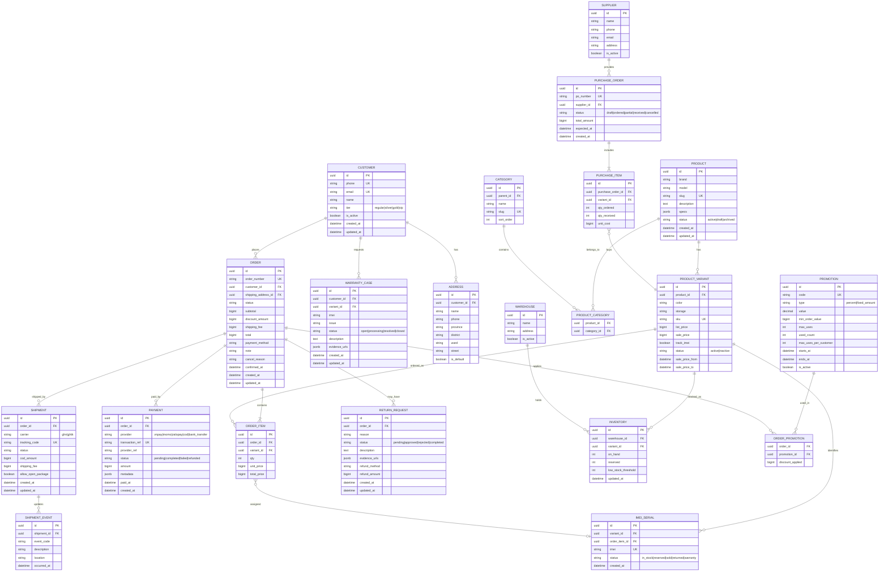

# Database Design Document

**Phiên bản:** 1.0.0  
**Ngày:** 2026-02-19  

---

## 1. Entity Relationship Diagram (ERD)



---

## 2. Data Dictionary

### 2.1 Bảng CUSTOMER

| Column | Type | Constraints | Mô tả |
|---|---|---|---|
| id | UUID | PK, DEFAULT gen_random_uuid() | Định danh duy nhất |
| phone | VARCHAR(15) | UNIQUE, NOT NULL | Số điện thoại (định dạng VN) |
| email | VARCHAR(255) | UNIQUE | Email đăng nhập |
| name | VARCHAR(255) | NOT NULL | Họ tên đầy đủ |
| tier | VARCHAR(20) | DEFAULT 'regular' | Hạng thành viên |
| is_active | BOOLEAN | DEFAULT true | Tài khoản có hoạt động không |
| created_at | TIMESTAMPTZ | DEFAULT NOW() | Thời gian tạo (UTC) |
| updated_at | TIMESTAMPTZ | DEFAULT NOW() | Cập nhật cuối (UTC) |

### 2.2 Bảng PRODUCT_VARIANT

| Column | Type | Constraints | Mô tả |
|---|---|---|---|
| id | UUID | PK | Định danh |
| product_id | UUID | FK → PRODUCT, NOT NULL | Sản phẩm cha |
| color | VARCHAR(50) | NOT NULL | Màu sắc (vd: "Đen", "Titanium") |
| storage | VARCHAR(20) | NOT NULL | Dung lượng (vd: "128GB", "256GB") |
| sku | VARCHAR(100) | UNIQUE, NOT NULL | Mã SKU |
| list_price | BIGINT | NOT NULL, CHECK ≥ 0 | Giá niêm yết (VNĐ, integer) |
| sale_price | BIGINT | CHECK ≥ 0 | Giá sale (NULL nếu không sale) |
| track_imei | BOOLEAN | DEFAULT false | Có theo dõi IMEI không |
| sale_price_from | TIMESTAMPTZ | | Thời gian bắt đầu sale |
| sale_price_to | TIMESTAMPTZ | | Thời gian kết thúc sale |

### 2.3 Bảng INVENTORY

| Column | Type | Constraints | Mô tả |
|---|---|---|---|
| id | UUID | PK | Định danh |
| warehouse_id | UUID | FK → WAREHOUSE, NOT NULL | Kho |
| variant_id | UUID | FK → PRODUCT_VARIANT, NOT NULL | Biến thể sản phẩm |
| on_hand | INT | NOT NULL, DEFAULT 0, CHECK ≥ 0 | Tồn kho thực |
| reserved | INT | NOT NULL, DEFAULT 0, CHECK ≥ 0 | Đã đặt giữ |
| low_stock_threshold | INT | DEFAULT 5 | Ngưỡng cảnh báo tồn thấp |

**Constraint:** `UNIQUE(warehouse_id, variant_id)`  
**Computed:** `available = on_hand - reserved` (tính lúc query)

### 2.4 Bảng ORDER

| Column | Type | Constraints | Mô tả |
|---|---|---|---|
| status | VARCHAR(30) | NOT NULL | Trạng thái: new/confirmed/packing/shipping/delivered/completed/cancelled/return_requested/returned |
| subtotal | BIGINT | NOT NULL | Tổng tiền hàng trước giảm |
| discount_amount | BIGINT | DEFAULT 0 | Số tiền giảm |
| shipping_fee | BIGINT | DEFAULT 0 | Phí vận chuyển |
| total | BIGINT | NOT NULL | Tổng tiền phải trả |

---

## 3. Indexing Strategy

### 3.1 Primary Indexes (tự động từ PK)
Tất cả bảng có PRIMARY KEY UUID, PostgreSQL tự tạo B-tree index.

### 3.2 Additional Indexes

```sql
-- Product/Search
CREATE INDEX idx_product_status ON product(status);
CREATE INDEX idx_product_brand ON product(brand);
CREATE INDEX idx_product_slug ON product(slug);  -- UNIQUE
CREATE INDEX idx_variant_product_id ON product_variant(product_id);
CREATE INDEX idx_variant_sku ON product_variant(sku);  -- UNIQUE

-- Inventory
CREATE UNIQUE INDEX idx_inventory_warehouse_variant ON inventory(warehouse_id, variant_id);
CREATE INDEX idx_inventory_variant ON inventory(variant_id);

-- IMEI
CREATE UNIQUE INDEX idx_imei ON imei_serial(imei);
CREATE INDEX idx_imei_variant ON imei_serial(variant_id);
CREATE INDEX idx_imei_status ON imei_serial(status);

-- Order
CREATE INDEX idx_order_customer ON "order"(customer_id);
CREATE INDEX idx_order_status ON "order"(status);
CREATE INDEX idx_order_created ON "order"(created_at DESC);
CREATE INDEX idx_order_number ON "order"(order_number);  -- UNIQUE

-- Payment
CREATE INDEX idx_payment_order ON payment(order_id);
CREATE UNIQUE INDEX idx_payment_ref ON payment(transaction_ref);

-- Shipment
CREATE INDEX idx_shipment_order ON shipment(order_id);
CREATE UNIQUE INDEX idx_shipment_tracking ON shipment(tracking_code);

-- Promotion
CREATE UNIQUE INDEX idx_promotion_code ON promotion(code);
CREATE INDEX idx_promotion_active ON promotion(is_active, starts_at, ends_at);

-- Full-text search (PostgreSQL tsvector)
CREATE INDEX idx_product_fts ON product USING gin(to_tsvector('simple', coalesce(brand,'') || ' ' || coalesce(model,'')));
```

### 3.3 Partial Indexes

```sql
-- Chỉ index active products
CREATE INDEX idx_product_active ON product(status) WHERE status = 'active';

-- Chỉ index available promotions
CREATE INDEX idx_promo_valid ON promotion(ends_at) WHERE is_active = true;

-- IMEI còn trong kho
CREATE INDEX idx_imei_in_stock ON imei_serial(variant_id) WHERE status = 'in_stock';
```

---

## 4. Migration Strategy

### 4.1 Tool
Sử dụng **Prisma Migrate** (nếu Node.js) hoặc **golang-migrate** (nếu Go) để quản lý database migrations.

### 4.2 Migration Principles
1. **Forward-only migrations** – không dùng down migrations trong production
2. **Expand-Contract pattern** cho breaking changes:
   - Expand: Thêm cột mới (nullable)
   - Migrate: Backfill dữ liệu cũ
   - Contract: Remove cột cũ (release tiếp theo)
3. **Zero-downtime migrations:** Thêm cột mới phải nullable hoặc có DEFAULT
4. Mỗi migration có timestamp prefix: `20260219_001_create_customer_table.sql`

### 4.3 Data Migration Plan (từ hệ thống cũ)

| Bước | Mô tả | Thời gian |
|---|---|---|
| 1 | Export dữ liệu sản phẩm từ POS/spreadsheet | 1–2 ngày |
| 2 | Transform & validate (SKU, price, category) | 1–2 ngày |
| 3 | Import vào staging, kiểm tra | 1 ngày |
| 4 | Import tồn kho ban đầu | 1 ngày |
| 5 | Migration khách hàng (nếu có) | 1–2 ngày |
| 6 | Final import production trước Go-live | 4–8 giờ |

---

## 5. Backup & Retention

| Loại backup | Tần suất | Retention | Tool |
|---|---|---|---|
| Full backup | Hàng ngày (2:00 AM) | 30 ngày | pg_dump + S3 |
| WAL archiving | Liên tục | 7 ngày | pg_basebackup / pgBackRest |
| Point-in-time recovery | – | 7 ngày | WAL streaming |
| Pre-deployment snapshot | Trước mỗi deploy | 30 ngày | Manual pg_dump |

---

## 6. Database Configuration (Production)

```ini
# postgresql.conf recommendations
max_connections = 200
shared_buffers = 2GB              # 25% RAM
effective_cache_size = 6GB        # 75% RAM
work_mem = 64MB
maintenance_work_mem = 512MB
wal_level = replica
max_wal_senders = 3
checkpoint_completion_target = 0.9
random_page_cost = 1.1            # SSD storage
effective_io_concurrency = 200    # SSD storage
log_min_duration_statement = 1000 # Log slow queries > 1s
```
