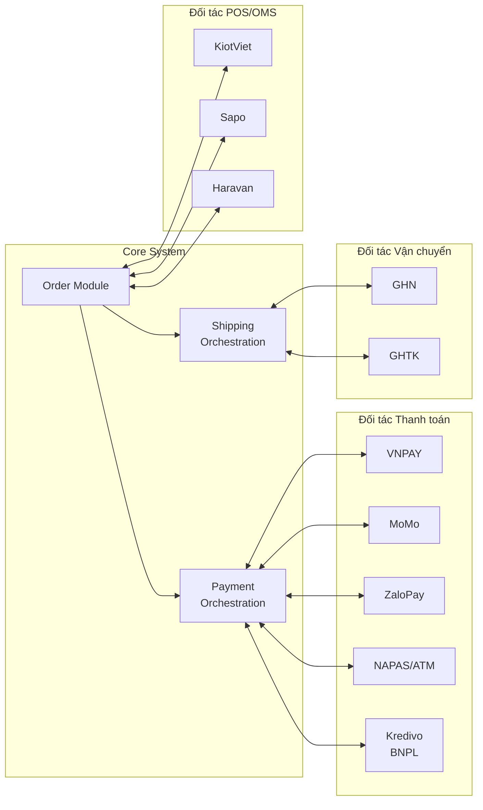
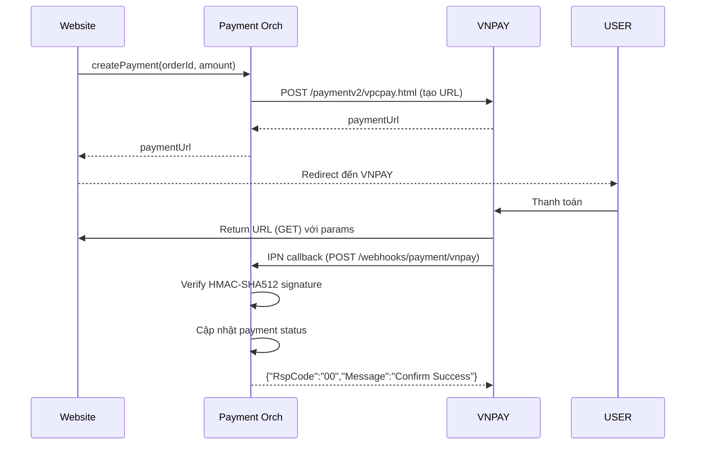
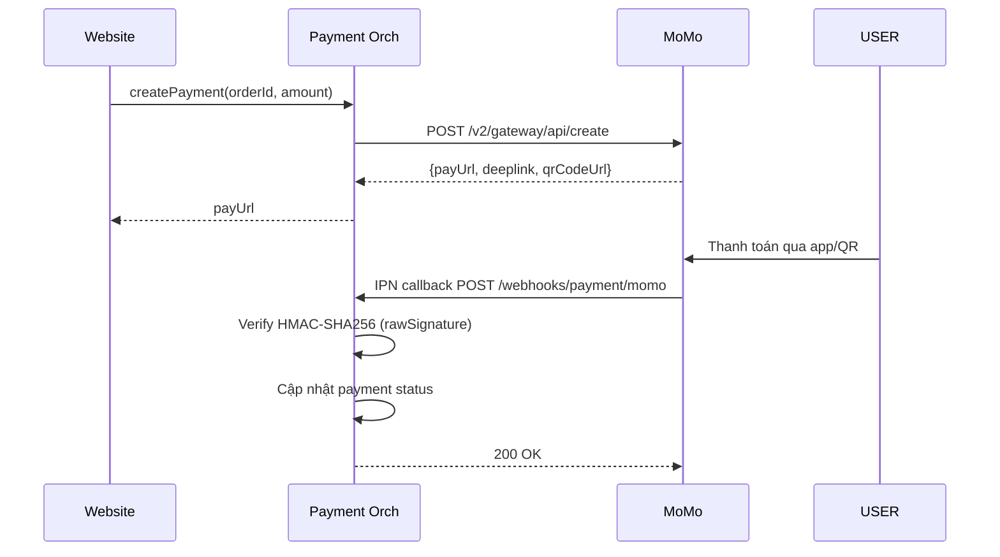
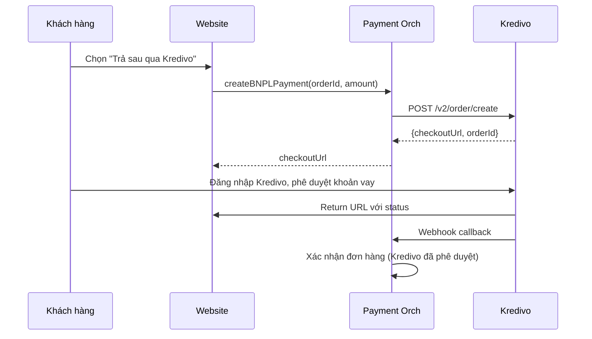
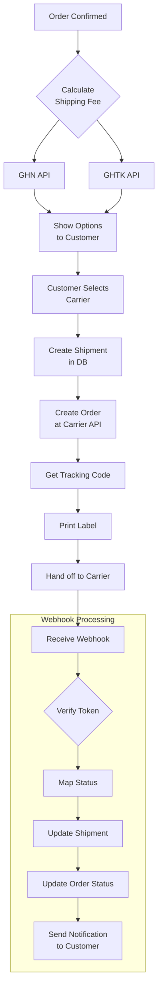

# Integration Architecture

**Phiên bản:** 1.0.0  
**Ngày:** 2026-02-19  

---

## 1. Tổng quan tích hợp

Hệ thống tích hợp với các đối tác bên thứ ba thông qua lớp **Orchestration** (Payment Orchestration và Shipping Orchestration), đóng vai trò adapter pattern – che giấu chi tiết triển khai của từng đối tác với business logic core.



---

## 2. Tích hợp Cổng Thanh toán

### 2.1 VNPAY

**Luồng tích hợp:**


**Thông tin kỹ thuật:**
- API Endpoint: `https://pay.vnpay.vn/vpcpay.html`
- Sandbox: `https://sandbox.vnpayment.vn/paymentv2/vpcpay.html`
- Authentication: HMAC-SHA512 với secret key
- Webhook (IPN): POST đến `/webhooks/payment/vnpay`
- Timeout thanh toán: 15 phút

**Thông tin cần đăng ký:**
- Merchant ID (vnp_TmnCode)
- Secret Hash Key (vnp_HashSecret)
- Return URL (whitelist tại VNPAY)
- IPN URL (whitelist tại VNPAY)

---

### 2.2 MoMo

**Luồng tích hợp:**


**Thông tin kỹ thuật:**
- API: `https://payment.momo.vn/v2/gateway/api/create`
- Sandbox: `https://test-payment.momo.vn/v2/gateway/api/create`
- Authentication: HMAC-SHA256
- Hỗ trợ: QR Code, DeepLink, MoMo Wallet

---

### 2.3 ZaloPay

**Thông tin kỹ thuật:**
- API: `https://openapi.zalopay.vn/v2/create`
- Authentication: HMAC-SHA256 với appkey
- Callback: POST đến `/webhooks/payment/zalopay`
- Hỗ trợ: QR Code, ZaloPay Wallet, ATM card

---

### 2.4 Kredivo (BNPL)

**Luồng đặc biệt cho Pay Later:**


---

### 2.5 Payment Orchestration Abstraction

```typescript
interface PaymentProvider {
  createPayment(params: CreatePaymentParams): Promise<PaymentResult>;
  verifyWebhook(payload: unknown, signature: string): boolean;
  processRefund(transactionRef: string, amount: number): Promise<RefundResult>;
}

// Concrete implementations
class VNPayProvider implements PaymentProvider { ... }
class MoMoProvider implements PaymentProvider { ... }
class ZaloPayProvider implements PaymentProvider { ... }

// Orchestration Service
class PaymentOrchestrationService {
  getProvider(name: string): PaymentProvider {
    return this.providers[name]; // Factory pattern
  }
}
```

---

## 3. Tích hợp Đơn vị Vận chuyển

### 3.1 GHN (Giao Hàng Nhanh)

**API Endpoints:**

| Chức năng | Method | Endpoint |
|---|---|---|
| Tính phí vận chuyển | POST | `/shiip/public-api/v2/shipping-order/fee` |
| Tạo vận đơn | POST | `/shiip/public-api/v2/shipping-order/create` |
| In nhãn | GET | `/shiip/public-api/v2/a5/gen-token` |
| Hủy vận đơn | POST | `/shiip/public-api/v2/switch-status/cancel` |
| Thông tin vận đơn | GET | `/shiip/public-api/v2/shipping-order/detail` |

**Webhook (Tracking Update):**
```json
{
  "order_code": "XXXXXXXXXX",
  "status": "delivered",
  "description": "Giao hàng thành công",
  "time": "2026-02-19T10:00:00Z"
}
```

**Trạng thái GHN → Trạng thái hệ thống:**

| GHN Status | Hệ thống |
|---|---|
| `ready_to_pick` | shipping |
| `picking` | shipping |
| `picked` | shipping |
| `storing` | shipping |
| `transporting` | shipping |
| `sorting` | shipping |
| `delivering` | shipping |
| `delivered` | delivered |
| `delivery_fail` | delivery_failed |
| `return` | returning |
| `returned` | returned |
| `cancel` | cancelled |

---

### 3.2 GHTK (Giao Hàng Tiết Kiệm)

**API Endpoints:**

| Chức năng | Method | Endpoint |
|---|---|---|
| Tính phí | GET | `/services/shipment/fee` |
| Tạo đơn | POST | `/services/shipment/order` |
| Hủy đơn | POST | `/services/shipment/order/cancel/{tracking_id}` |
| Thông tin đơn | GET | `/services/shipment/v2/{tracking_id}` |

**Webhook:**
```json
{
  "partner_id": "...",
  "label_id": "...",
  "status_id": 8,
  "reason": "",
  "weight": 0.3,
  "pick_money": 0
}
```

---

### 3.3 Shipping Orchestration Flow



---

## 4. Tích hợp POS/Omnichannel (Giai đoạn 2)

### 4.1 KiotViet

**Các API cần thiết:**
- `GET /api/products` – đồng bộ danh sách sản phẩm
- `GET /api/inventories` – đồng bộ tồn kho
- `POST /api/orders` – tạo đơn hàng từ web sang POS
- `GET /api/customers` – đồng bộ khách hàng

**Luồng đồng bộ:**
```mermaid
flowchart LR
  subgraph KiotViet
    KV_PROD[Products]
    KV_INV[Inventory]
    KV_ORD[Orders]
  end

  subgraph Web System
    WEB_CAT[Catalog]
    WEB_INV[Inventory]
    WEB_ORD[Orders]
    SYNC[Sync Service\n(cron/webhook)]
  end

  KV_PROD -->|Webhook/Polling| SYNC
  SYNC -->|Upsert| WEB_CAT
  KV_INV -->|Polling 5 phút| SYNC
  SYNC -->|Update| WEB_INV
  WEB_ORD -->|New Order| SYNC
  SYNC -->|Create| KV_ORD
```

### 4.2 Chiến lược đồng bộ

| Loại dữ liệu | Phương thức | Tần suất |
|---|---|---|
| Sản phẩm mới | Webhook từ KiotViet | Realtime |
| Giá sản phẩm | Webhook từ KiotViet | Realtime |
| Tồn kho | Polling + Webhook | Mỗi 5 phút |
| Đơn hàng web → POS | Event (khi confirmed) | Realtime |
| Khách hàng | Polling | Mỗi giờ |

---

## 5. Notification Services

### 5.1 Email (Transactional)

Sử dụng **SendGrid** hoặc **AWS SES**:

| Trigger | Template |
|---|---|
| Đăng ký tài khoản | Xác thực email, chào mừng |
| Đặt hàng thành công | Xác nhận đơn hàng với chi tiết |
| Đơn hàng thay đổi trạng thái | Thông báo trạng thái mới |
| Giao hàng thành công | Xác nhận nhận hàng, link đánh giá |
| Yêu cầu đổi trả | Xác nhận ticket, hướng dẫn tiếp theo |
| Tồn kho thấp (Admin) | Cảnh báo nội bộ |

### 5.2 SMS/Zalo ZNS

Sử dụng **ESMS** hoặc **Zalo ZNS** cho thông báo OTP và trạng thái đơn:

| Trigger | Kênh | Nội dung |
|---|---|---|
| OTP xác thực | SMS | "Mã xác thực của bạn là: XXXXXX" |
| Xác nhận đơn hàng | Zalo ZNS / SMS | Tóm tắt đơn + link theo dõi |
| Đơn đang giao | Zalo ZNS | Thông báo shipper sắp đến |

---

## 6. Integration Error Handling

### 6.1 Retry Strategy

```
Webhook processing:
  Attempt 1: Immediate
  Attempt 2: +5 seconds
  Attempt 3: +30 seconds
  Attempt 4: +2 minutes
  Attempt 5: +10 minutes
  → Dead letter queue sau 5 lần thất bại → Alert admin

External API calls:
  Timeout: 10 seconds
  Retry: 3 lần với exponential backoff
  Circuit breaker: Open sau 5 lần thất bại liên tiếp trong 1 phút
```

### 6.2 Idempotency

Tất cả webhook handlers phải idempotent:
- Lưu `provider_ref` (transaction ID từ gateway) với UNIQUE constraint
- Nếu nhận webhook trùng: trả về 200 OK ngay lập tức (đã xử lý)
- Log cả duplicate webhooks để audit

### 6.3 Monitoring Integration Health

```yaml
Alerts:
  - Payment webhook failure rate > 1% → PagerDuty alert
  - Shipping webhook lag > 5 minutes → Slack alert
  - Payment provider API error rate > 5% → Circuit breaker open
  - COD reconciliation mismatch → Daily report to admin
```
