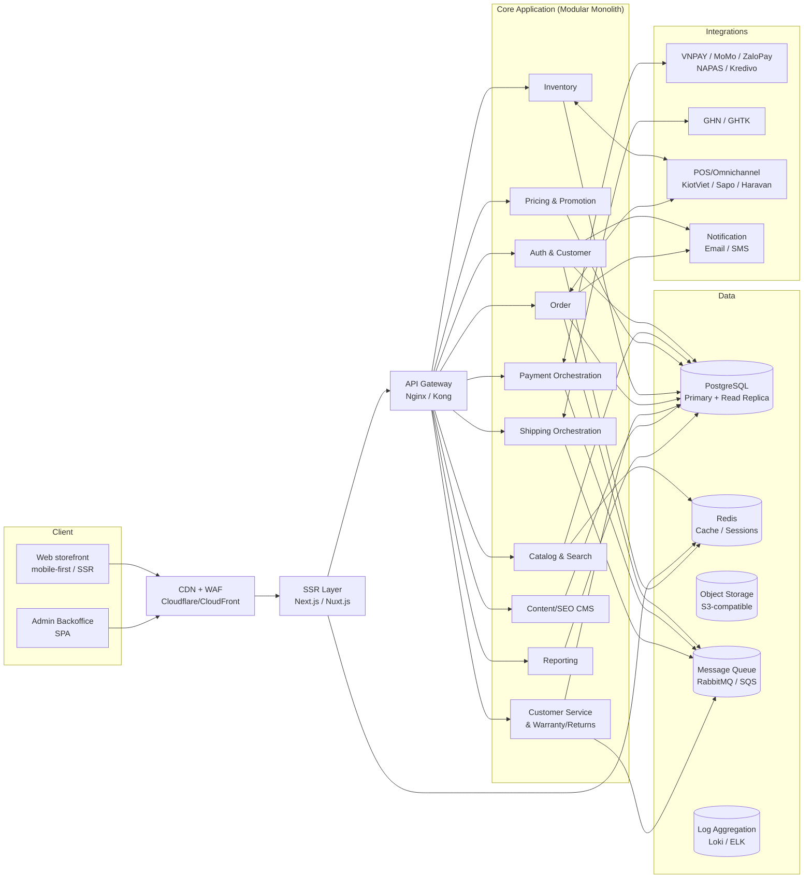
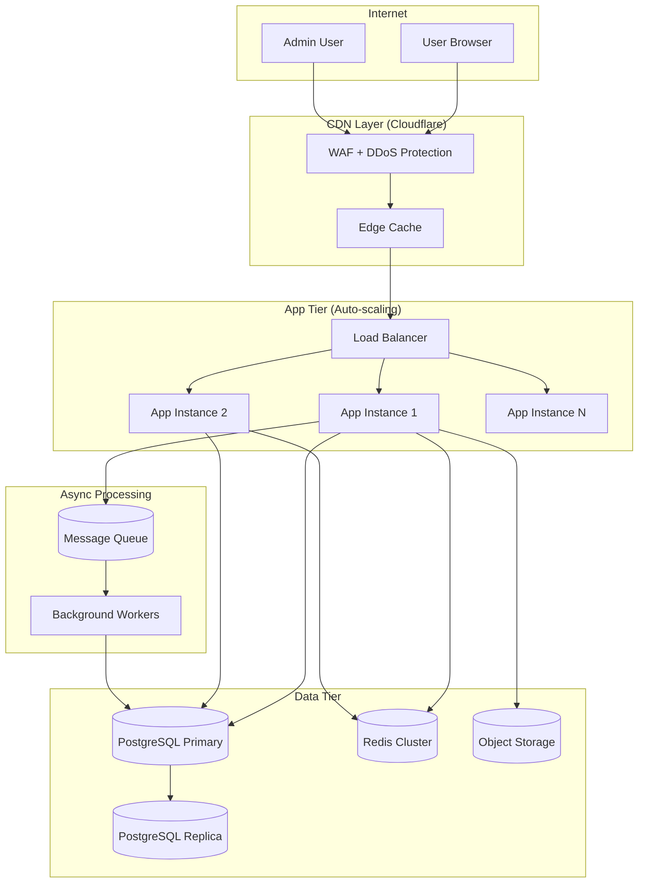
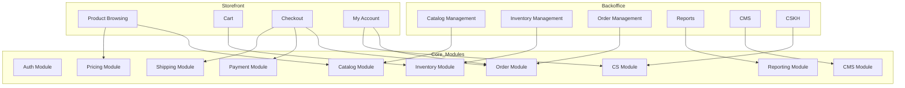

# System Architecture Document (SAD)

**Phiên bản:** 1.0.0  
**Ngày:** 2026-02-19  
**Chuẩn tham chiếu:** TOGAF ADM, C4 Model  

---

## 1. Tổng quan kiến trúc

### 1.1 Mục tiêu kiến trúc
Hệ thống được thiết kế theo nguyên tắc:
- **Dễ vận hành:** Modular monolith ở giai đoạn đầu, giảm độ phức tạp vận hành
- **Dễ mở rộng:** Module boundaries rõ ràng, sẵn sàng tách microservices khi cần
- **Tối ưu rủi ro:** Tích hợp bên thứ ba qua abstraction layer, dễ thay thế vendor
- **Mobile-first & SEO:** SSR/SSG ở tầng frontend

### 1.2 Architecture Style
- **Backend:** Modular Monolith (Phase 1) → Microservices (Phase 3 nếu cần)
- **Frontend:** Server-Side Rendering (SSR) + Static Site Generation (SSG)
- **Data:** PostgreSQL (primary) + Redis (cache/sessions) + Object Storage (files)
- **Communication:** REST API (sync) + Message Queue (async events)

---

## 2. Sơ đồ kiến trúc tổng thể

### 2.1 High-Level Architecture



### 2.2 Deployment Architecture



---

## 3. Technology Stack

### 3.1 Backend

| Thành phần | Technology | Lý do lựa chọn |
|---|---|---|
| Runtime | Node.js 20 LTS / Go 1.22 | Performance, ecosystem, talent pool |
| Framework | NestJS (Node) / Gin (Go) | Structured, DI, modular |
| ORM | Prisma (Node) / GORM (Go) | Type-safe queries, migration support |
| API Style | REST + JSON | Đơn giản, tương thích rộng |
| Auth | JWT + Passport.js | Industry standard |
| Queue | BullMQ (Redis-based) / RabbitMQ | Reliable job processing |
| Testing | Jest / Go testing | Unit + integration tests |

### 3.2 Frontend

| Thành phần | Technology | Lý do lựa chọn |
|---|---|---|
| Framework | Next.js 14+ (App Router) | SSR/SSG, SEO, React ecosystem |
| Styling | Tailwind CSS | Mobile-first utility-first |
| State | Zustand / React Query | Lightweight, data fetching |
| Admin UI | Ant Design / shadcn/ui | Rich component library |
| Testing | Playwright (E2E), Jest (unit) | |

### 3.3 Infrastructure

| Thành phần | Technology | Ghi chú |
|---|---|---|
| Cloud Provider | AWS / GCP / DigitalOcean | Tùy ngân sách & kinh nghiệm team |
| Container | Docker + Docker Compose | Development & deployment |
| Orchestration | Kubernetes (giai đoạn 2+) | Bắt đầu với docker-compose |
| CDN | Cloudflare | WAF, DDoS, edge cache miễn phí |
| Database | PostgreSQL 15+ | ACID, JSON support, partitioning |
| Cache | Redis 7+ | Sessions, cache, queue |
| Object Storage | AWS S3 / Cloudflare R2 | Product images, invoices |
| CI/CD | GitHub Actions | Free tier đủ cho dự án |
| Monitoring | Prometheus + Grafana | Metrics |
| Logging | Loki + Grafana | Log aggregation |
| APM | OpenTelemetry | Tracing |

---

## 4. Module Architecture

### 4.1 Module Boundaries



### 4.2 Event-Driven Flows

| Event | Publisher | Subscribers |
|---|---|---|
| `order.created` | Order Module | Payment, Inventory (reserve), Notification |
| `payment.completed` | Payment Module | Order (update status), Notification |
| `payment.failed` | Payment Module | Order (cancel), Inventory (release reserve) |
| `shipment.status_updated` | Shipping Module | Order (update status), Notification, CS |
| `inventory.low_stock` | Inventory Module | Notification (admin) |
| `return.approved` | CS Module | Inventory (update), Payment (refund) |

---

## 5. API Architecture

### 5.1 API Layers

```
Public Storefront API   (/api/v1/*)
  → No auth required: /products, /search, /categories
  → Auth required: /cart, /orders, /account

Admin API               (/api/admin/v1/*)
  → All endpoints require admin role
  → RBAC per endpoint

Webhook Endpoints       (/webhooks/*)
  → Payment: /webhooks/payment/{provider}
  → Shipping: /webhooks/shipping/{carrier}
  → HMAC signature verification required
```

### 5.2 Versioning Strategy
- URL versioning: `/api/v1/`, `/api/v2/`
- Version deprecation: 6 tháng notice trước khi remove
- Backward compatibility trong cùng major version

### 5.3 Error Response Format
```json
{
  "error": {
    "code": "PRODUCT_NOT_FOUND",
    "message": "Sản phẩm không tìm thấy",
    "details": {},
    "requestId": "uuid-v4"
  }
}
```

---

## 6. Data Architecture

### 6.1 Database Strategy
- **Single PostgreSQL instance** cho Phase 1 (modular monolith)
- **Read replica** cho reporting queries từ Phase 2
- Tất cả modules dùng chung 1 database nhưng khác schema/prefix table

### 6.2 Caching Strategy

| Data | Cache TTL | Invalidation |
|---|---|---|
| Product listing | 5 phút | Khi sản phẩm cập nhật |
| Product detail | 10 phút | Khi variant cập nhật |
| Category tree | 30 phút | Khi danh mục cập nhật |
| Cart (user session) | 7 ngày | Khi user checkout/clear |
| Auth tokens | 15 phút (access), 30 ngày (refresh) | Logout/revoke |
| Inventory available | 30 giây | Khi reserve/release |

---

## 7. Security Architecture Overview

*(Chi tiết tại [Security Architecture](../04-security-compliance/security-architecture.md))*

- TLS 1.2+ cho tất cả kết nối
- WAF trước API Gateway (Cloudflare)
- JWT với refresh token rotation
- Input validation ở mọi controller
- Parameterized queries (no raw SQL)
- Audit log cho mọi write operation

---

## 8. Scalability Considerations

### Phase 1 (MVP)
- 1 app instance + 1 PostgreSQL + Redis
- Target: 50–200 concurrent users
- Deploy: Docker Compose trên single VPS (4 CPU, 8GB RAM)

### Phase 2 (Scale out)
- 2–3 app instances behind load balancer
- PostgreSQL primary + 1 read replica
- Redis cluster (3 nodes)
- Deploy: Managed Kubernetes (GKE/EKS)

### Phase 3 (Microservices nếu cần)
- Tách các module high-load (Catalog, Inventory) thành independent services
- Message-driven architecture với Kafka/RabbitMQ
- Deploy: Kubernetes multi-zone
