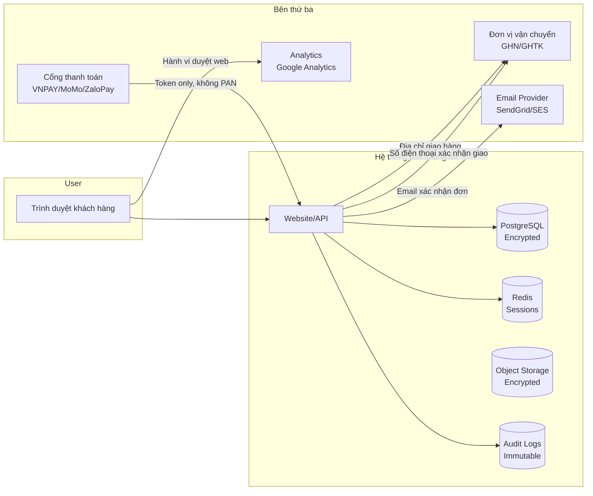
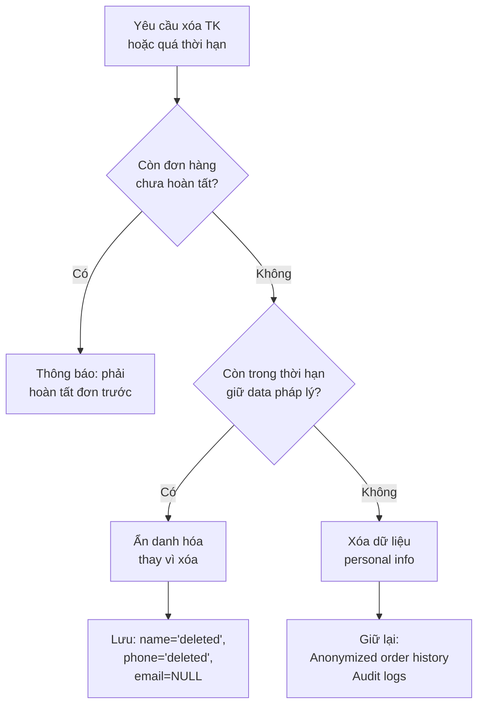

# Data Protection – Bảo vệ dữ liệu cá nhân

**Phiên bản:** 1.0.0  
**Ngày:** 2026-02-19  
**Chuẩn tham chiếu:** Nghị định 13/2023/NĐ-CP  

---

## 1. Chính sách Bảo vệ Dữ liệu

### 1.1 Cam kết
Doanh nghiệp cam kết thu thập, xử lý và bảo vệ dữ liệu cá nhân của khách hàng theo đúng quy định của Nghị định 13/2023/NĐ-CP và các văn bản pháp luật có liên quan.

### 1.2 Phạm vi áp dụng
- Tất cả dữ liệu cá nhân thu thập từ website
- Dữ liệu nhân viên (xử lý riêng)
- Dữ liệu từ bên thứ ba (đơn vị vận chuyển, payment gateway)

---

## 2. Dữ liệu thu thập và mục đích

### 2.1 Dữ liệu thu thập khi đăng ký/mua hàng

| Loại dữ liệu | Bắt buộc | Mục đích | Cơ sở pháp lý |
|---|---|---|---|
| Số điện thoại | ✅ | Đăng nhập, OTP, liên hệ, giao hàng | Đồng ý + Hợp đồng |
| Họ tên | ✅ | Hóa đơn, giao hàng | Hợp đồng |
| Địa chỉ giao hàng | ✅ (khi mua) | Giao vận | Hợp đồng |
| Email | ❌ | Thông báo, marketing | Đồng ý |
| Lịch sử đơn hàng | Tự động | CSKH, đổi trả, bảo hành | Hợp đồng |
| Hành vi duyệt web | Tự động | Cải thiện trải nghiệm, analytics | Đồng ý (cookie) |
| Device/IP | Tự động | Bảo mật, chống gian lận | Lợi ích hợp pháp |

### 2.2 Dữ liệu KHÔNG thu thập

Hệ thống **không bao giờ** thu thập:
- Số CCCD/CMND (trừ trường hợp pháp lý yêu cầu xác minh)
- Thông tin thẻ ngân hàng (số thẻ, CVV, ngày hết hạn)
- Thông tin sinh trắc học
- Dữ liệu nhạy cảm (tôn giáo, sức khỏe, chính trị)

---

## 3. Luồng dữ liệu (Data Flow)



### 3.1 Dữ liệu chia sẻ với bên thứ ba

| Bên thứ ba | Dữ liệu chia sẻ | Mục đích | Cơ sở pháp lý |
|---|---|---|---|
| GHN/GHTK | Tên, SĐT, địa chỉ người nhận | Giao vận | Thực hiện hợp đồng |
| VNPAY/MoMo/ZaloPay | Số tiền, mã đơn hàng | Thanh toán | Thực hiện hợp đồng |
| SendGrid/AWS SES | Email, tên | Gửi thông báo | Đồng ý |
| Google Analytics | Ẩn danh (không PII) | Analytics | Đồng ý (cookie) |

**Hợp đồng xử lý dữ liệu (DPA):** Phải ký DPA với tất cả bên thứ ba nhận dữ liệu cá nhân.

---

## 4. Data Retention Policy

### 4.1 Thời gian lưu trữ

| Loại dữ liệu | Thời gian lưu | Lý do |
|---|---|---|
| Tài khoản khách hàng | Đến khi xóa TK hoặc 5 năm không hoạt động | Hỗ trợ CSKH |
| Đơn hàng | 5 năm từ ngày giao dịch | Yêu cầu thuế/kế toán |
| Hóa đơn | 10 năm | Yêu cầu kế toán/thuế |
| Lịch sử thanh toán | 5 năm | Đối soát, chống gian lận |
| Audit logs | 3 năm | Điều tra sự cố |
| Session data | 30 ngày | Bảo mật |
| Web analytics | 26 tháng | Cải thiện sản phẩm |
| Backup database | 30 ngày rolling | Disaster recovery |

### 4.2 Quy trình xóa dữ liệu



### 4.3 Ẩn danh hóa (Anonymization)

Khi không thể xóa hoàn toàn (vd: đơn hàng trong thời gian giữ hóa đơn):
```sql
UPDATE customer
SET 
  name = 'Khách hàng đã xóa',
  phone = NULL,
  email = NULL,
  is_active = false,
  deleted_at = NOW()
WHERE id = :customerId;
```

---

## 5. Quyền của Chủ thể Dữ liệu

### 5.1 Triển khai kỹ thuật

**API endpoints cho quyền chủ thể dữ liệu:**

```
GET  /api/v1/account/data-export    → Xuất toàn bộ dữ liệu (JSON)
PUT  /api/v1/account/profile        → Cập nhật thông tin
DELETE /api/v1/account              → Yêu cầu xóa tài khoản
POST /api/v1/account/marketing-opt-out → Opt-out marketing
```

**Thời gian xử lý:**
- Yêu cầu truy cập/xuất dữ liệu: 72 giờ (tự động)
- Yêu cầu xóa: 5–7 ngày làm việc (có bước xác minh)
- Yêu cầu chỉnh sửa: Ngay lập tức (tự phục vụ) hoặc 48 giờ (qua CSKH)

### 5.2 Xác minh danh tính

Trước khi xử lý yêu cầu liên quan đến dữ liệu, phải xác minh:
- Xác thực OTP qua số điện thoại đăng ký
- Hoặc xác thực qua email đăng ký

---

## 6. Cookie Policy

### 6.1 Phân loại cookies

| Loại | Ví dụ | Có thể từ chối? |
|---|---|---|
| **Cần thiết** | Session cookie, CSRF token | Không (cần để website hoạt động) |
| **Chức năng** | Ngôn ngữ, địa chỉ giao hàng đã lưu | Có thể |
| **Analytics** | Google Analytics | Có thể |
| **Marketing** | Facebook Pixel, Google Ads | Có thể |

### 6.2 Cookie Consent Banner

```
[Cookie Consent Banner UI]
"Website sử dụng cookies để cải thiện trải nghiệm của bạn.
Chúng tôi sử dụng cookies cần thiết, analytics và marketing.
[Chấp nhận tất cả] [Chỉ cần thiết] [Tùy chỉnh]"
```

**Lưu trạng thái đồng ý:** Lưu trong localStorage + truyền lên server để log.

### 6.3 Third-party Scripts

| Script | Điều kiện tải |
|---|---|
| Google Analytics | Chỉ khi user đồng ý analytics cookies |
| Facebook Pixel | Chỉ khi user đồng ý marketing cookies |
| Google Ads | Chỉ khi user đồng ý marketing cookies |
| VNPAY/MoMo scripts | Chỉ khi user mở trang thanh toán |

---

## 7. Privacy Notice (Chính sách Bảo mật) – Nội dung cần có

Website phải có trang Chính sách Bảo mật với nội dung:

1. **Ai thu thập:** Tên và thông tin liên hệ của doanh nghiệp
2. **Thu thập gì:** Danh sách dữ liệu thu thập
3. **Tại sao thu thập:** Mục đích cho từng loại dữ liệu
4. **Chia sẻ với ai:** Danh sách bên thứ ba
5. **Giữ bao lâu:** Retention period
6. **Quyền của bạn:** Liệt kê đầy đủ quyền chủ thể dữ liệu
7. **Cách thực hiện quyền:** Liên hệ qua email/form
8. **Cập nhật:** Ngày cập nhật chính sách gần nhất

---

## 8. Security for Data Protection

*(Xem chi tiết tại [Security Architecture](security-architecture.md))*

Các biện pháp kỹ thuật chính:
- Mã hóa AES-256 cho dữ liệu nhạy cảm tại rest
- TLS 1.2+ cho dữ liệu di chuyển
- Pseudonymization cho analytics data
- Access logging cho mọi truy cập vào PII
- Principle of least privilege cho database users
