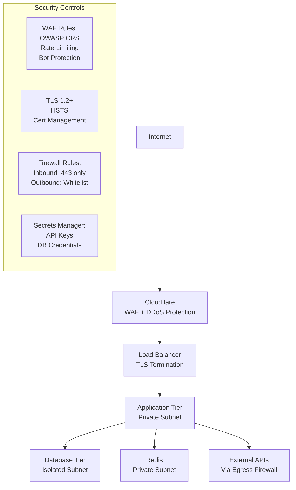
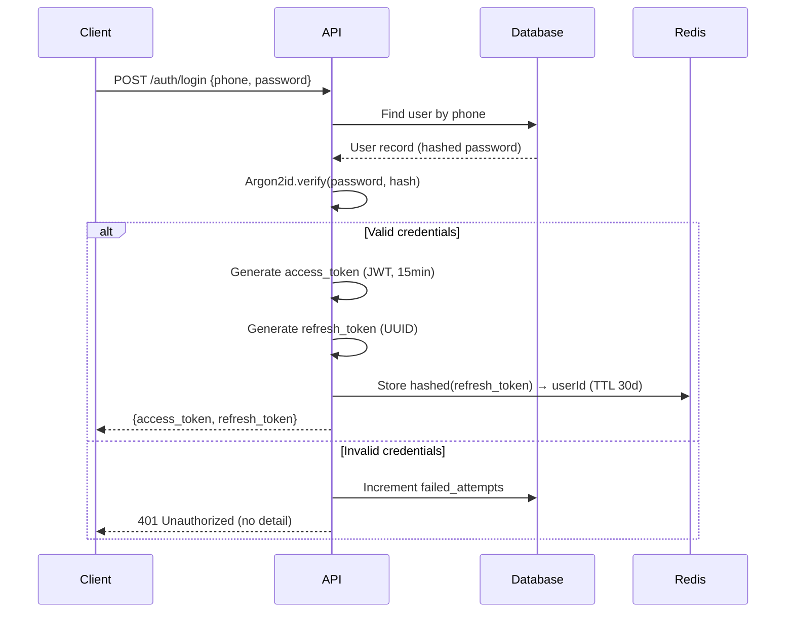
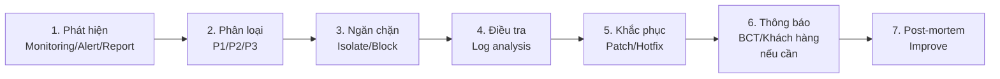

# Security Architecture Document

**Phiên bản:** 1.0.0  
**Ngày:** 2026-02-19  
**Chuẩn tham chiếu:** OWASP Top 10 2021, OWASP API Security Top 10 2023, PCI DSS v4.0  

---

## 1. Security Overview

### 1.1 Security Principles
- **Defense in Depth:** Nhiều lớp bảo mật, không phụ thuộc một điểm
- **Least Privilege:** Mỗi component chỉ có quyền tối thiểu cần thiết
- **Zero Trust:** Xác thực và kiểm tra quyền mọi request, kể cả nội bộ
- **Security by Design:** Bảo mật được thiết kế từ đầu, không phải bổ sung sau

### 1.2 Threat Model (STRIDE)

| Threat | Mô tả | Biện pháp |
|---|---|---|
| **S**poofing | Giả mạo danh tính | JWT + refresh token rotation; HMAC webhook signature |
| **T**ampering | Sửa dữ liệu | TLS 1.2+; signed payment payload; database audit log |
| **R**epudiation | Phủ nhận hành động | Audit log đầy đủ; immutable log |
| **I**nformation Disclosure | Lộ dữ liệu | Mã hóa dữ liệu nhạy cảm; RBAC; no over-fetching |
| **D**enial of Service | Tấn công từ chối dịch vụ | WAF; rate limiting; auto-scaling |
| **E**levation of Privilege | Leo thang đặc quyền | RBAC nghiêm ngặt; endpoint-level authorization |

---

## 2. Network Security Architecture



### 2.1 Network Segmentation

| Subnet | Components | Inbound | Outbound |
|---|---|---|---|
| Public | Load Balancer, CDN | 443 từ Internet | Subnet nội bộ |
| App Private | Application servers | Từ LB | DB subnet, External APIs |
| Data Private | PostgreSQL, Redis | Từ App subnet only | Không ra Internet |
| Management | Bastion host | VPN only | App, Data subnets |

### 2.2 Firewall Rules

```
Inbound to App:
  ALLOW tcp/8080 from Load Balancer IP
  DENY ALL other inbound

Outbound from App:
  ALLOW tcp/5432 to PostgreSQL IP (database)
  ALLOW tcp/6379 to Redis IP (cache)
  ALLOW tcp/443 to VNPAY, MoMo, ZaloPay IPs (payment)
  ALLOW tcp/443 to GHN, GHTK IPs (shipping)
  ALLOW tcp/25,465,587 to Email provider (notifications)
  DENY ALL other outbound
```

---

## 3. Application Security

### 3.1 Authentication Flow



### 3.2 JWT Structure

```json
{
  "header": {
    "alg": "RS256",
    "typ": "JWT"
  },
  "payload": {
    "sub": "user-uuid",
    "role": "customer",
    "iat": 1708358400,
    "exp": 1708359300,
    "jti": "unique-token-id"
  }
}
```

**Lưu ý bảo mật:**
- Dùng **RS256** (asymmetric) – private key ký, public key verify
- Access token TTL: **15 phút**
- Refresh token: UUID lưu dạng hashed (SHA-256) trong Redis
- Refresh token rotation: Mỗi lần dùng, tạo refresh token mới
- Token revocation: Blacklist jti trong Redis khi logout

### 3.3 RBAC Matrix

| Permission | superadmin | manager | staff | warehouse | customer |
|---|---|---|---|---|---|
| Xem sản phẩm (public) | ✅ | ✅ | ✅ | ✅ | ✅ |
| Quản lý sản phẩm | ✅ | ✅ | ❌ | ❌ | ❌ |
| Xem đơn hàng (tất cả) | ✅ | ✅ | ✅ | ❌ | ❌ |
| Cập nhật trạng thái đơn | ✅ | ✅ | ✅ | ❌ | ❌ |
| Quản lý tồn kho | ✅ | ✅ | ❌ | ✅ | ❌ |
| Xem báo cáo tài chính | ✅ | ✅ | ❌ | ❌ | ❌ |
| Quản lý nhân viên | ✅ | ❌ | ❌ | ❌ | ❌ |
| Xem đơn của mình | ❌ | ❌ | ❌ | ❌ | ✅ |

### 3.4 Input Validation

Áp dụng **validation ở mọi layer:**

```
Layer 1 - API Gateway: 
  - Max request size: 10MB
  - Content-Type validation
  
Layer 2 - Controller:
  - DTO validation (class-validator / Joi)
  - Type checking
  - Format validation (UUID, phone, email)
  
Layer 3 - Service:
  - Business logic validation
  
Layer 4 - Database:
  - Check constraints
  - NOT NULL constraints
```

**Chống SQL Injection:**
- Sử dụng ORM với parameterized queries (tuyệt đối không dùng string concatenation)
- Ví dụ: `prisma.product.findFirst({ where: { slug: slug } })` – SAFE

**Chống XSS:**
- Sanitize HTML input trong rich text fields (dùng DOMPurify server-side)
- Content-Security-Policy header ngăn inline scripts
- HTTPOnly cookies cho refresh token (nếu lưu trong cookie)

---

## 4. PCI DSS Compliance

### 4.1 Scope Reduction
Để giảm thiểu PCI DSS scope, hệ thống **không bao giờ**:
- Nhận, xử lý, hoặc lưu trữ số thẻ (PAN)
- Nhận hoặc lưu CVV/CVC
- Nhận hoặc lưu PIN

Tất cả dữ liệu thẻ đi trực tiếp từ trình duyệt → cổng thanh toán (iframe/redirect).

### 4.2 Lưu trữ an toàn

| Dữ liệu | Cách lưu | Không lưu |
|---|---|---|
| Payment token (từ gateway) | Encrypted field | Số thẻ đầy đủ |
| Provider reference (transaction ID) | Plain text | CVV |
| Payment method type | Plain text (vnpay/momo) | PIN |
| Payment amount | Integer | Thông tin thẻ bất kỳ |

### 4.3 Audit Logging cho Payments

```sql
CREATE TABLE payment_audit_log (
  id UUID PRIMARY KEY DEFAULT gen_random_uuid(),
  payment_id UUID NOT NULL,
  event_type VARCHAR(50) NOT NULL,  -- created, webhook_received, completed, refunded
  actor VARCHAR(100),               -- system, admin_id, webhook_provider
  old_status VARCHAR(20),
  new_status VARCHAR(20),
  metadata JSONB,
  ip_address INET,
  created_at TIMESTAMPTZ NOT NULL DEFAULT NOW()
);
-- Không có UPDATE/DELETE privilege cho app user trên bảng này
```

---

## 5. Data Security

### 5.1 Encryption at Rest

| Data | Encryption | Key Management |
|---|---|---|
| Database (PostgreSQL) | Transparent Data Encryption (TDE) | Cloud provider KMS |
| Object Storage (S3) | AES-256-SSE | Cloud provider managed |
| Backups | AES-256 | Separate key from data |
| Secrets (API keys) | HashiCorp Vault / AWS Secrets Manager | Rotation policy |

### 5.2 Encryption in Transit

| Connection | Protocol | Notes |
|---|---|---|
| Client ↔ CDN | TLS 1.2+ | Certificate by Let's Encrypt / DigiCert |
| CDN ↔ App | TLS 1.2+ | Origin certificate |
| App ↔ Database | TLS 1.2+ | Client certificate auth |
| App ↔ Payment Gateways | TLS 1.2+ | Verify gateway certificate |
| App ↔ Shipping APIs | TLS 1.2+ | |

### 5.3 PII (Personal Identifiable Information) Handling

Dữ liệu nhạy cảm cần bảo vệ đặc biệt:

| PII | Lưu trữ | Hiển thị | Xuất |
|---|---|---|---|
| Số điện thoại | Plain (cần cho OTP) | Mask: 090xxx4567 | Chỉ authorized export |
| Email | Plain | Hiển thị đầy đủ cho owner | Chỉ authorized export |
| Địa chỉ giao hàng | Plain | Chỉ cho owner + admin | Không |
| CCCD/CMND | Không lưu | - | - |
| Thông tin thẻ | Token only | Không | Không |

---

## 6. Security Operations

### 6.1 Vulnerability Management

| Hoạt động | Tần suất | Tool |
|---|---|---|
| Dependency vulnerability scan | Mỗi CI build | Snyk / npm audit |
| SAST (Static Analysis) | Mỗi PR | SonarQube / CodeQL |
| DAST (Dynamic Analysis) | Hàng tuần | OWASP ZAP |
| Penetration testing | Trước Go-live và hàng năm | Internal/External |
| Container image scan | Mỗi build | Trivy / Snyk |

### 6.2 Security Monitoring & Alerting

```yaml
Alert conditions:
  - Failed login attempts > 10/phút từ 1 IP → Block IP + Alert
  - Admin login từ IP lạ → Email alert + require 2FA
  - SQL injection pattern trong logs → Immediate alert
  - Unusual data export volume → Alert security team
  - Payment webhook signature failure > 3 lần → Alert
  - Multiple failed payments từ 1 user → Fraud alert
```

### 6.3 Incident Response Plan



**Phân loại sự cố:**
- **P1 (Critical):** Rò rỉ dữ liệu khách hàng, hệ thống sập → Phản hồi trong 1 giờ
- **P2 (High):** Lỗ hổng bảo mật có thể khai thác, gian lận thanh toán → 4 giờ
- **P3 (Medium):** Vulnerability patching, suspicious activity → 24 giờ

---

## 7. Security Checklist trước Go-live

- [ ] TLS 1.2+ cho tất cả endpoints, HSTS enabled
- [ ] Security headers đầy đủ (CSP, X-Frame-Options, etc.)
- [ ] OWASP Top 10 review hoàn tất, zero critical findings
- [ ] Dependency scan: zero high/critical CVE
- [ ] Không lưu bất kỳ dữ liệu thẻ thanh toán nào
- [ ] JWT RS256, rotation policy implemented
- [ ] Rate limiting hoạt động cho auth và public API
- [ ] WAF rules active (Cloudflare OWASP ruleset)
- [ ] Audit log hoạt động cho mọi write operation
- [ ] Backup encryption verified
- [ ] Secrets stored in Vault/Secrets Manager (không hardcode)
- [ ] Least privilege DB user (app không có DROP/TRUNCATE)
- [ ] Admin 2FA enabled
- [ ] Incident response runbook documented
