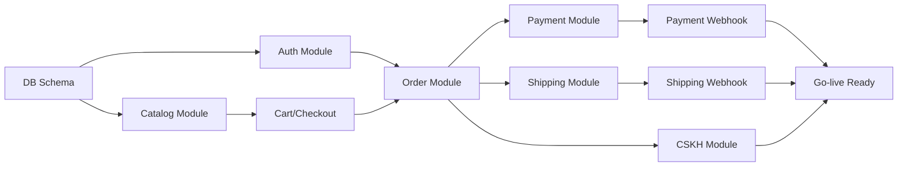

# Roadmap Triển khai

**Phiên bản:** 1.0.0  
**Ngày:** 2026-02-19  

---

## 1. Tổng quan lộ trình

Dự án được chia thành 3 giai đoạn chính:
- **Giai đoạn 1 – MVP (12–16 tuần):** Ra được hệ thống bán hàng thực tế
- **Giai đoạn 2 – Mở rộng vận hành (6–8 tuần tiếp theo):** Hoàn thiện tính năng
- **Giai đoạn 3 – Tăng trưởng (3–6 tháng sau Go-live):** Trade-in, Loyalty, đa kênh

---

## 2. Gantt Chart chi tiết

```mermaid
gantt
  title Roadmap Triển khai Website Bán Điện Thoại
  dateFormat  YYYY-MM-DD
  axisFormat  %d/%m

  section Giai đoạn Khởi động
  Khảo sát nghiệp vụ & chốt phạm vi MVP        :a1, 2026-02-20, 10d
  Thiết lập môi trường dev & CI/CD              :a2, 2026-02-20, 7d
  Wireframe + UI kit + luồng checkout           :a3, after a1, 12d
  DB schema design & review                     :a4, after a1, 7d
  Đăng ký cổng thanh toán (VNPAY/MoMo)          :a5, 2026-02-20, 14d

  section Sprint 1 – Auth & Catalog
  Module Auth (register/login/JWT)              :b1, after a3, 10d
  Module Catalog CRUD (product/variant)         :b2, after a3, 12d
  Module CMS (banner/pages)                     :b3, after a3, 8d
  Storefront: trang chủ, danh mục, tìm kiếm     :b4, after a3, 14d

  section Sprint 2 – Core Commerce
  Module Inventory (tồn kho, IMEI)              :c1, after b1, 10d
  Module Pricing & Promotions (voucher)         :c2, after b2, 10d
  Storefront: cart, checkout flow               :c3, after b4, 12d
  Module Order (tạo đơn, trạng thái)            :c4, after b1, 12d

  section Sprint 3 – Payments & Shipping
  Module Payment (VNPAY/MoMo/ZaloPay)          :d1, after c4, 14d
  Webhook payment handler                       :d2, after d1, 5d
  Module Shipping (GHN/GHTK)                   :d3, after c4, 12d
  Webhook shipping handler                      :d4, after d3, 5d

  section Sprint 4 – CSKH & Admin
  Admin backoffice (order mgmt, inventory)      :e1, after c4, 14d
  Module Customer Service (ticket, đổi trả)     :e2, after c4, 12d
  Module Reporting (doanh thu, tồn kho)         :e3, after c4, 10d

  section Hardening & Go-live
  QA: unit + integration + E2E tests            :f1, after d2, 14d
  Security review & penetration test            :f2, after e1, 7d
  UAT với stakeholders                          :f3, after f1, 7d
  Compliance check (BCT thông báo, policies)    :f4, after e2, 5d
  Performance optimization (CWV)               :f5, after f1, 5d
  Production deployment                         :milestone, f6, after f3, 1d
  Go-live monitoring (3 ngày đầu)               :f7, after f6, 3d

  section Giai đoạn 2 – Mở rộng
  Khuyến mãi nâng cao (flash sale, combo)       :g1, after f6, 20d
  Báo cáo đối soát COD & thanh toán             :g2, after f6, 15d
  Trade-in cơ bản                               :g3, after g1, 25d
  Tích hợp POS (KiotViet/Sapo)                 :g4, after f6, 30d

  section Giai đoạn 3 – Tăng trưởng
  Loyalty/CRM (điểm, hạng, remarketing)         :h1, after g4, 30d
  SEO nâng cao (CWV, schema markup)             :h2, after g2, 20d
  Tối ưu hiệu năng & auto-scaling               :h3, after g4, 20d
  Mobile app (giai đoạn sau)                    :h4, after h1, 60d
```

---

## 3. Sprint Planning (Agile)

### 3.1 Cấu trúc Sprint

- **Sprint length:** 2 tuần
- **Velocity ước tính:** 30–40 story points/sprint (team 6–9 người)
- **Ceremonies:**
  - Sprint Planning: Thứ 2 đầu sprint (2–3 giờ)
  - Daily Standup: 15 phút/ngày
  - Sprint Review: Thứ 6 cuối sprint (1 giờ)
  - Sprint Retrospective: Thứ 6 cuối sprint (1 giờ)

### 3.2 Sprint Breakdown

| Sprint | Tuần | Focus | Story Points |
|---|---|---|---|
| Sprint 0 | 1–2 | Setup môi trường, khảo sát nghiệp vụ, thiết kế | 20 |
| Sprint 1 | 3–4 | Auth, Catalog, CMS, Storefront cơ bản | 40 |
| Sprint 2 | 5–6 | Inventory, Pricing, Cart, Checkout UI | 38 |
| Sprint 3 | 7–8 | Order Management, Payment Integration | 40 |
| Sprint 4 | 9–10 | Shipping Integration, Admin Backoffice | 38 |
| Sprint 5 | 11–12 | CSKH, Reporting, Storefront finalize | 35 |
| Sprint 6 | 13–14 | QA, Security, UAT, Performance | 25 |
| Sprint 7 | 15–16 | Hardening, Compliance, Production Deploy | 20 |

---

## 4. Dependencies & Critical Path

### 4.1 Dependency Map



### 4.2 Critical Path

**Đường găng (không thể trì hoãn):**
1. DB Schema Design (tuần 1–2)
2. Auth Module (tuần 3–4)
3. Order Module (tuần 7–8)
4. Payment Integration + Webhook (tuần 7–10)
5. QA & UAT (tuần 13–15)
6. Production Deploy (tuần 16)

**Rủi ro trên critical path:**
- Đăng ký cổng thanh toán chậm → Bắt đầu ngay tuần 1
- Webhook testing phức tạp → Dùng ngrok/localtunnel từ tuần 7
- UAT phát hiện lỗi nhiều → Buffer 1 tuần trước Go-live

---

## 5. Resource Allocation

### 5.1 Team Structure

| Vai trò | Số lượng | Giai đoạn tham gia |
|---|---|---|
| Tech Lead / Architect | 1 | Toàn thời gian |
| Backend Developer | 2–3 | Sprint 1 → Go-live |
| Frontend Developer | 1–2 | Sprint 1 → Go-live |
| DevOps Engineer | 1 | Sprint 0 → Go-live |
| QA Engineer | 1 | Sprint 3 → Go-live |
| Project Manager | 1 | Toàn thời gian |
| Designer (UI/UX) | 1 | Sprint 0–3 (part-time) |

### 5.2 Responsibility Matrix (RACI)

| Activity | Tech Lead | Backend Dev | Frontend Dev | DevOps | QA | PM |
|---|---|---|---|---|---|---|
| DB Design | A,R | C | I | I | I | I |
| API Development | A | R | C | I | C | I |
| Frontend Development | C | C | A,R | I | C | I |
| CI/CD Setup | C | I | I | A,R | I | I |
| Test Execution | C | C | C | I | A,R | I |
| Deployment | A | C | C | R | I | I |
| Stakeholder Communication | C | I | I | I | I | A,R |

*R=Responsible, A=Accountable, C=Consulted, I=Informed*

---

## 6. Milestones

| Milestone | Ngày dự kiến | Deliverable |
|---|---|---|
| **M1: Kickoff** | 2026-02-20 | Team assembled, environment ready |
| **M2: Design Approved** | 2026-03-06 | Wireframes, DB schema, API specs |
| **M3: Alpha** | 2026-04-03 | Core modules working in dev |
| **M4: Beta** | 2026-05-01 | All MVP features in staging |
| **M5: UAT Complete** | 2026-05-22 | Stakeholder sign-off |
| **M6: Go-live** | 2026-05-30 | Production launch |
| **M7: Stable** | 2026-06-30 | 30 ngày vận hành ổn định |
| **M8: Phase 2 Complete** | 2026-08-15 | POS integration, advanced promotions |

---

## 7. Definition of Done (DoD)

Một story/feature được coi là DONE khi:
- [ ] Code review được approved bởi ít nhất 1 peer
- [ ] Unit tests pass với coverage ≥ 70%
- [ ] Integration tests pass
- [ ] No critical/high security vulnerability
- [ ] Deployed lên staging environment
- [ ] QA sign-off
- [ ] Documentation updated (nếu cần)
- [ ] No regression trong các tính năng liên quan

---

## 8. Go-live Checklist

### Kỹ thuật
- [ ] All MVP features deployed to production
- [ ] Database migrations applied
- [ ] SSL/TLS certificate valid
- [ ] CDN configured và caching hoạt động
- [ ] Monitoring & alerting active
- [ ] Backup schedule active
- [ ] Rollback plan tested

### Nghiệp vụ
- [ ] Sản phẩm đã được nhập đầy đủ
- [ ] Tồn kho ban đầu đã được cập nhật
- [ ] Hợp đồng cổng thanh toán đã ký (production credentials)
- [ ] Hợp đồng đơn vị vận chuyển đã ký
- [ ] Nhân viên CSKH đã được training

### Compliance
- [ ] Thông báo website BCT đã hoàn tất
- [ ] Trang chính sách (bảo mật, đổi trả, bảo hành) đã publish
- [ ] Logo BCT hiển thị trên website
- [ ] Cookie consent banner active
