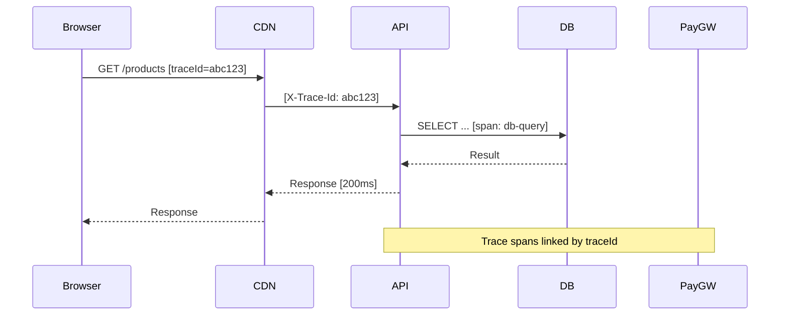

# Monitoring & Alerting

**Phiên bản:** 1.0.0  
**Ngày:** 2026-02-19  

---

## 1. Monitoring Architecture

### 1.1 Stack

| Component | Tool | Purpose |
|---|---|---|
| Metrics | Prometheus | Time-series metrics collection |
| Visualization | Grafana | Dashboards và alerting UI |
| Logging | Loki | Log aggregation và search |
| Tracing | Tempo + OpenTelemetry | Distributed request tracing |
| Uptime | UptimeRobot / Checkly | External synthetic monitoring |
| Error Tracking | Sentry | Application error tracking |

### 1.2 Instrumentation

**Backend (NestJS):**
```typescript
// main.ts – OpenTelemetry setup
import { NodeSDK } from '@opentelemetry/sdk-node';
import { PrometheusExporter } from '@opentelemetry/exporter-prometheus';
import { OTLPTraceExporter } from '@opentelemetry/exporter-trace-otlp-http';

const sdk = new NodeSDK({
  traceExporter: new OTLPTraceExporter({
    url: process.env.OTEL_EXPORTER_OTLP_ENDPOINT,
  }),
  metricReader: new PrometheusExporter({ port: 9090 }),
});
sdk.start();
```

**Custom Metrics:**
```typescript
// metrics.service.ts
import { Counter, Histogram } from 'prom-client';

export const orderCreatedCounter = new Counter({
  name: 'orders_created_total',
  help: 'Total orders created',
  labelNames: ['payment_method', 'carrier'],
});

export const paymentDuration = new Histogram({
  name: 'payment_processing_duration_seconds',
  help: 'Payment processing duration',
  labelNames: ['provider', 'status'],
  buckets: [0.1, 0.5, 1, 2, 5],
});
```

---

## 2. Application Metrics

### 2.1 Business Metrics

```
# Đơn hàng
orders_created_total{payment_method, carrier}
orders_by_status{status}
orders_completed_total
orders_cancelled_total
orders_cancellation_rate

# Thanh toán
payment_attempts_total{provider}
payment_success_total{provider}
payment_failure_total{provider, reason}
payment_success_rate{provider}
payment_processing_duration_seconds{provider}

# Tồn kho
inventory_low_stock_count{warehouse}
inventory_out_of_stock_count

# Người dùng
user_registrations_total
active_sessions_count
cart_abandonment_rate
```

### 2.2 Technical Metrics

```
# HTTP
http_requests_total{method, endpoint, status}
http_request_duration_seconds{method, endpoint}

# Database
pg_query_duration_seconds{query_type}
pg_connections_active
pg_connections_max
pg_replication_lag_seconds

# Redis
redis_hit_rate{cache_name}
redis_memory_usage_bytes
redis_commands_duration_seconds

# Queue
queue_depth{queue_name}
queue_processing_duration_seconds{queue_name}
queue_failures_total{queue_name}
```

---

## 3. Grafana Dashboards

### 3.1 Overview Dashboard

```
Row 1: Health
  - API Uptime (last 30d)
  - Current Error Rate
  - Average Response Time
  - Active Users (last 1h)

Row 2: Business Metrics (Today)
  - Orders Created
  - Revenue
  - Payment Success Rate
  - Conversion Rate (sessions → orders)

Row 3: Infrastructure
  - CPU Usage per Instance
  - Memory Usage per Instance
  - Database Connections
  - Cache Hit Rate
```

### 3.2 API Performance Dashboard

Visualize per-endpoint performance:

```
- Top 10 slowest endpoints (P95)
- Error rate per endpoint
- Request volume heatmap (endpoint × time)
- Latency percentiles over time (P50, P95, P99)
- Apdex score per endpoint
```

### 3.3 Business Metrics Dashboard

```
- Order funnel: Browse → Cart → Checkout → Payment → Completed
- Payment method distribution (pie chart)
- Orders by carrier (GHN vs GHTK)
- Revenue by product category
- Top selling products (last 7 days)
- Order status distribution
- Return/refund rate
```

---

## 4. Distributed Tracing

### 4.1 Trace Propagation



### 4.2 Key Traces to Monitor

| Trace | Alert if P95 > |
|---|---|
| Order creation (API → DB → Queue) | 500ms |
| Payment webhook processing | 200ms |
| Shipping webhook processing | 200ms |
| Product search | 200ms |
| Cart reservation | 150ms |

---

## 5. Log Queries (Loki/Grafana)

### 5.1 Common Queries

```logql
# All errors in last 1 hour
{service="bandienthoai-api"} |= "level=ERROR" | last 1h

# Payment failures
{service="bandienthoai-api", event="payment.failed"} | json | last 24h

# Slow requests (> 1s)
{service="bandienthoai-api"} | json | duration > 1000

# Failed webhook attempts
{service="bandienthoai-api", event="webhook.received"} 
  | json 
  | status = "signature_invalid" 
  | last 1h

# Order status transitions
{service="bandienthoai-api"} 
  | json 
  | event = "order.status_changed"
  | line_format "{{.orderId}} {{.oldStatus}} → {{.newStatus}}"
```

### 5.2 Log Alerting Rules

```yaml
# Loki alert: nhiều lỗi authentication trong thời gian ngắn
- alert: BruteForceDetected
  expr: |
    count_over_time(
      {service="bandienthoai-api"} 
      |= "AUTH_FAILED" 
      | json 
      [5m]
    ) > 50
  annotations:
    summary: "Possible brute force attack: >50 auth failures in 5min"
```

---

## 6. Uptime Monitoring

### 6.1 External Checks (UptimeRobot/Checkly)

| Check | URL | Interval | Alert |
|---|---|---|---|
| Homepage | https://bandienthoai.vn | 1 phút | SMS + Slack |
| API Health | https://api.bandienthoai.vn/health | 1 phút | SMS + Slack |
| Product API | https://api.bandienthoai.vn/api/v1/products | 5 phút | Slack |
| Checkout page | https://bandienthoai.vn/cart | 5 phút | Slack |
| Admin login | https://admin.bandienthoai.vn | 5 phút | Slack |

### 6.2 SSL Certificate Monitoring

```bash
# Kiểm tra cert expiry (chạy daily)
check_ssl() {
  DOMAIN=$1
  EXPIRY=$(echo | openssl s_client -servername $DOMAIN -connect $DOMAIN:443 2>/dev/null | openssl x509 -noout -dates | grep "notAfter" | cut -d= -f2)
  DAYS=$(( ($(date -d "$EXPIRY" +%s) - $(date +%s)) / 86400 ))
  
  if [ $DAYS -lt 14 ]; then
    send_alert "SSL cert for $DOMAIN expires in $DAYS days!"
  fi
}

check_ssl bandienthoai.vn
check_ssl api.bandienthoai.vn
```

---

## 7. Performance Monitoring

### 7.1 Core Web Vitals Monitoring

Sử dụng **Cloudflare Browser Insights** hoặc **Google Search Console** để theo dõi real-user CWV:

```javascript
// frontend: report CWV to backend analytics
import { onLCP, onINP, onCLS } from 'web-vitals';

const reportMetric = ({ name, value, rating }) => {
  fetch('/api/v1/analytics/cwv', {
    method: 'POST',
    body: JSON.stringify({
      metric: name,
      value: value,
      rating: rating,  // 'good' | 'needs-improvement' | 'poor'
      page: window.location.pathname,
    }),
  });
};

onLCP(reportMetric);
onINP(reportMetric);
onCLS(reportMetric);
```

**Dashboard CWV:**
- LCP P75 per page type (home, product, checkout)
- INP per page type
- CLS per page type
- Percentage "Good" vs "Needs Improvement" vs "Poor"

### 7.2 Database Performance Monitoring

```sql
-- Slow query monitoring (pg_stat_statements)
SELECT 
  substring(query, 1, 100) as short_query,
  calls,
  round(mean_exec_time::numeric, 2) as avg_ms,
  round(total_exec_time::numeric, 2) as total_ms,
  stddev_exec_time::numeric as stddev_ms
FROM pg_stat_statements
WHERE mean_exec_time > 100  -- queries slower than 100ms average
ORDER BY mean_exec_time DESC
LIMIT 20;
```

---

## 8. On-Call Procedures

### 8.1 Escalation Path

```
Level 1: Automated self-healing (auto-restart failed pods)
    ↓ (nếu không tự giải quyết sau 5 phút)
Level 2: On-call DevOps (PagerDuty alert)
    ↓ (nếu cần expertise domain)
Level 3: Tech Lead
    ↓ (nếu ảnh hưởng kinh doanh nghiêm trọng)
Level 4: CTO / Management
```

### 8.2 On-Call Toolkit

```bash
# Quick health check
kubectl get pods -n production
kubectl get deployments -n production

# Check recent errors
kubectl logs -l app=bandienthoai-api -n production --tail=100 | grep ERROR

# Check database
kubectl exec -it deployment/bandienthoai-api -n production -- \
  node -e "const {db} = require('./db'); db.\$queryRaw\`SELECT 1\`"

# Check Redis
kubectl exec -it deployment/redis -n production -- redis-cli ping

# Restart a pod
kubectl rollout restart deployment/bandienthoai-api -n production
```
