# Operations Manual – Sổ tay Vận hành

**Phiên bản:** 1.0.0  
**Ngày:** 2026-02-19  

---

## 1. Tổng quan vận hành

### 1.1 SLA (Service Level Agreement)

| Metric | Target | Measurement |
|---|---|---|
| **Uptime** | ≥ 99.5%/tháng | Synthetic monitoring (mỗi 1 phút) |
| **API Response Time P95** | < 200ms | APM tracing |
| **Payment Success Rate** | ≥ 99% | Payment monitoring |
| **Incident Response (P1)** | < 1 giờ | Thời gian từ alert đến xử lý |
| **Incident Response (P2)** | < 4 giờ | Thời gian từ alert đến xử lý |
| **Incident Resolution (P1)** | < 4 giờ | Thời gian từ phát hiện đến giải quyết |

### 1.2 Operational Hours

| Dịch vụ | Giờ vận hành | On-call |
|---|---|---|
| Website (customer-facing) | 24/7 | Hệ thống tự xử lý + on-call P1 |
| Admin backoffice | 24/7 | Giờ hành chính |
| CSKH (con người) | 8:00–22:00 | Ticket tự động ngoài giờ |
| DevOps on-call | Chỉ P1/P2 | Rotation team |

---

## 2. Monitoring Stack

### 2.1 Architecture

```mermaid
flowchart LR
  APP[Application\nInstances] --> OTEL[OpenTelemetry\nCollector]
  APP --> PROM[Prometheus\nMetrics]
  APP --> LOKI[Loki\nLog Aggregation]
  
  OTEL --> TEMPO[Tempo\nTracing]
  PROM --> GRAF[Grafana\nDashboards]
  LOKI --> GRAF
  TEMPO --> GRAF
  
  PROM --> ALERT[Alertmanager]
  ALERT --> SLACK[Slack]
  ALERT --> PAGER[PagerDuty\n(P1 only)]
  ALERT --> EMAIL[Email]
```

### 2.2 Key Dashboards

| Dashboard | Metrics chính |
|---|---|
| **Overview** | Request rate, error rate, latency, active users |
| **API Performance** | P50/P95/P99 per endpoint, slow queries |
| **Business Metrics** | Orders/giờ, payment success rate, conversion funnel |
| **Infrastructure** | CPU, memory, disk, network per instance |
| **Database** | Query time, connections, replication lag, slow queries |
| **Payment** | Payment attempts, success/failure rate per provider |
| **Inventory** | Low stock alerts, inventory movements |

---

## 3. Alerting Configuration

### 3.1 P1 Alerts (Immediate – PagerDuty + Slack)

```yaml
# prometheus-alerts.yaml (một số ví dụ)
groups:
  - name: p1-critical
    rules:
      - alert: APIDown
        expr: up{job="bandienthoai-api"} == 0
        for: 1m
        labels:
          severity: p1
        annotations:
          summary: "API is DOWN"
          
      - alert: HighErrorRate
        expr: rate(http_requests_total{status=~"5.."}[5m]) / rate(http_requests_total[5m]) > 0.05
        for: 2m
        labels:
          severity: p1
        annotations:
          summary: "Error rate > 5% for 2 minutes"
          
      - alert: PaymentWebhookFailing
        expr: rate(webhook_processing_errors_total{provider=~"vnpay|momo|zalopay"}[5m]) > 0.01
        for: 5m
        labels:
          severity: p1
        annotations:
          summary: "Payment webhook failure rate > 1%"
          
      - alert: DatabaseDown
        expr: pg_up == 0
        for: 30s
        labels:
          severity: p1
        annotations:
          summary: "PostgreSQL is DOWN"
```

### 3.2 P2 Alerts (Slack + Email)

```yaml
      - alert: HighResponseTime
        expr: histogram_quantile(0.95, rate(http_request_duration_seconds_bucket[5m])) > 0.5
        for: 5m
        labels:
          severity: p2
        annotations:
          summary: "P95 response time > 500ms"
          
      - alert: LowInventoryAlert
        expr: inventory_available < inventory_low_stock_threshold
        labels:
          severity: p2
        annotations:
          summary: "Product running low on stock: {{ $labels.sku }}"
          
      - alert: ReplicationLag
        expr: pg_replication_lag_seconds > 30
        for: 5m
        labels:
          severity: p2
        annotations:
          summary: "Database replication lag > 30s"
```

### 3.3 P3 Alerts (Daily Report)

- Failed background jobs > 10/ngày
- Slow queries > 2s trong 24 giờ qua
- Disk usage > 70%
- Memory usage > 85%

---

## 4. Logging Standards

### 4.1 Log Levels

| Level | Khi nào dùng |
|---|---|
| ERROR | Exception, payment failure, critical business error |
| WARN | Deprecated usage, retry attempt, soft error |
| INFO | Business event: order created, payment completed, user registered |
| DEBUG | Detailed flow, được tắt trong production |

### 4.2 Structured Log Format

```json
{
  "timestamp": "2026-02-19T10:00:00.000Z",
  "level": "INFO",
  "service": "order-service",
  "traceId": "abc123",
  "spanId": "def456",
  "userId": "customer-uuid",
  "event": "order.created",
  "data": {
    "orderId": "order-uuid",
    "total": 29990000,
    "paymentMethod": "vnpay",
    "itemCount": 1
  }
}
```

### 4.3 Log Retention

| Log type | Retention | Storage |
|---|---|---|
| Application logs | 30 ngày | Loki |
| Access logs | 90 ngày | S3 (compressed) |
| Error logs | 1 năm | S3 |
| Audit logs | 3 năm | S3 (immutable) |
| Security event logs | 3 năm | S3 (immutable) |

### 4.4 Sensitive Data in Logs

**KHÔNG được log:**
- Mật khẩu, token, API keys
- Số thẻ ngân hàng
- Số điện thoại đầy đủ (chỉ log dạng mask: 090xxx4567)
- Địa chỉ giao hàng đầy đủ

---

## 5. Backup & Disaster Recovery

### 5.1 Backup Schedule

```mermaid
gantt
  title Lịch Backup hàng ngày
  dateFormat HH:mm
  axisFormat %H:%M

  section Database
  Full backup (pg_dump)       :00:00, 2h
  WAL archiving (continuous)  :00:00, 24h

  section Object Storage
  S3 cross-region replication  :00:00, 24h

  section Application
  Config backup               :02:30, 30m
```



### 5.2 Backup Verification

- **Hàng tuần:** Restore backup vào môi trường test và verify data integrity
- **Hàng tháng:** Full disaster recovery drill (restore to new infrastructure)
- **Trước major release:** Manual snapshot và verify

### 5.3 Disaster Recovery Procedure

**Scenario 1: Database failure**
```bash
# 1. Failover to read replica (nếu primary down)
# (Managed DB sẽ tự failover nếu dùng AWS RDS Multi-AZ)

# 2. Manual: Promote replica to primary
# AWS RDS Console → Reboot with Failover
# hoặc: aws rds failover-db-cluster --db-cluster-identifier bandienthoai-prod

# 3. Update connection string (nếu cần)
kubectl set env deployment/bandienthoai-api DATABASE_URL=<new-primary-url> -n production

# 4. Verify application health
kubectl rollout status deployment/bandienthoai-api -n production
./scripts/smoke-tests.sh production
```

**Scenario 2: Full infrastructure failure (region down)**
```bash
# 1. Activate DR region
# 2. Restore latest backup to DR region database
# 3. Deploy application to DR region
# 4. Update DNS to point to DR region (Cloudflare failover)
# Target: RTO < 1 giờ, RPO < 1 giờ
```

### 5.4 Recovery Time Objectives

| Component | RTO | RPO |
|---|---|---|
| Application (single instance fail) | < 5 phút | 0 (stateless) |
| Database primary fail | < 15 phút | < 5 phút |
| Full region failure | < 1 giờ | < 1 giờ |
| Data corruption | < 2 giờ | < 1 giờ |

---

## 6. Maintenance Windows

### 6.1 Planned Maintenance

| Loại | Thời gian | Tần suất | Thông báo |
|---|---|---|---|
| Patching OS/Dependencies | 02:00–04:00 chủ nhật | Hàng tháng | 3 ngày trước |
| Database maintenance | 02:00–03:00 thứ Tư | Hàng tháng | 3 ngày trước |
| Major releases | 02:00–06:00 thứ Hai | Theo kế hoạch | 7 ngày trước |

### 6.2 Thông báo Maintenance

Kênh thông báo:
1. Banner trên website: "Hệ thống bảo trì từ XX:00 – XX:00 ngày DD/MM/YYYY"
2. Email cho khách hàng đang có đơn hàng trong quá trình
3. Thông báo admin dashboard

---

## 7. Operational Runbooks

### 7.1 Runbook: Xử lý đơn hàng bị kẹt

**Triệu chứng:** Đơn ở trạng thái "shipping" quá 7 ngày mà không có update từ carrier.

**Bước xử lý:**
1. Kiểm tra webhook log: `SELECT * FROM webhook_log WHERE carrier='ghn' AND created_at > NOW()-INTERVAL '7 days'`
2. Gọi API carrier để lấy trạng thái hiện tại
3. Cập nhật thủ công nếu carrier xác nhận đã giao
4. Nếu thất lạc: liên hệ carrier theo quy trình khiếu nại
5. Thông báo cho khách hàng

### 7.2 Runbook: Payment Webhook thất bại

**Triệu chứng:** Alert "Payment webhook failure rate > 1%"

**Bước xử lý:**
1. Kiểm tra log: `grep "webhook payment" /logs/error.log | tail -50`
2. Xác định provider bị lỗi (VNPAY/MoMo/ZaloPay)
3. Kiểm tra signature verification (thường do key mismatch)
4. Nếu lỗi network: kiểm tra firewall, TLS cert
5. Reprocess failed webhooks từ dead letter queue:
   ```bash
   kubectl exec -it deployment/bandienthoai-api -n production -- \
     node scripts/reprocess-webhooks.js --provider=vnpay --from=2026-02-19T10:00:00Z
   ```

### 7.3 Runbook: Database Slow Queries

**Triệu chứng:** P95 API response time tăng cao

**Bước xử lý:**
1. Xác định slow queries: `SELECT query, mean_exec_time, calls FROM pg_stat_statements ORDER BY mean_exec_time DESC LIMIT 10`
2. Phân tích EXPLAIN ANALYZE cho query chậm nhất
3. Thêm index nếu thiếu (thực hiện CONCURRENTLY để tránh lock)
4. Cập nhật query nếu có N+1 problem
5. Invalidate Redis cache nếu cache miss rate cao
