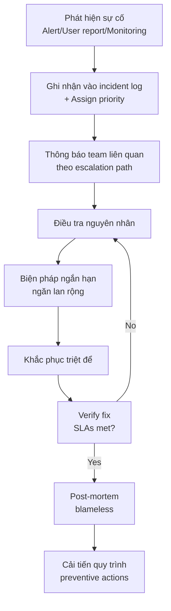
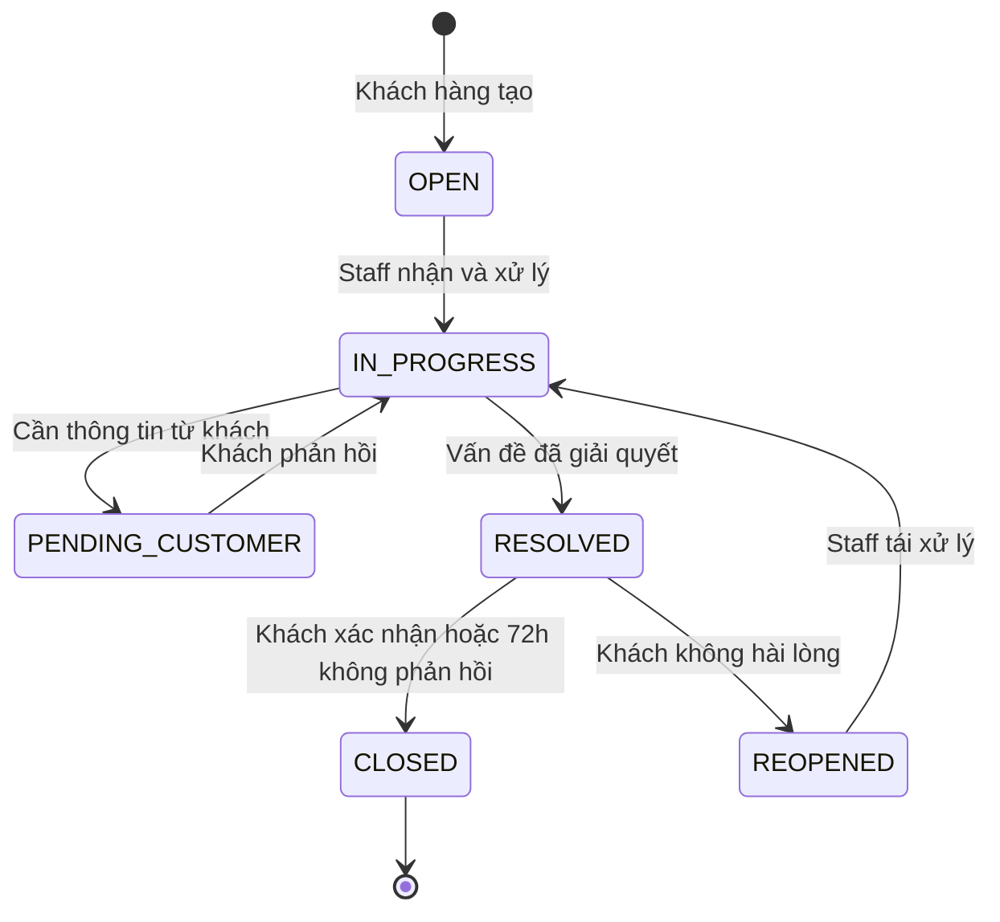

# Support & Maintenance Plan

**Phiên bản:** 1.0.0  
**Ngày:** 2026-02-19  

---

## 1. Support Model

### 1.1 Support Tiers

| Tier | Kênh | Đối tượng | SLA Phản hồi |
|---|---|---|---|
| **Tier 1 – Self-service** | FAQ, Help center, Chatbot | Khách hàng | Tức thì |
| **Tier 2 – CSKH** | Live chat, Email, Zalo | Khách hàng | 4 giờ làm việc |
| **Tier 3 – Technical** | Internal ticket | Staff escalate từ Tier 2 | 24 giờ |
| **Tier 4 – Dev Team** | GitHub Issues / Jira | Internal only | Theo severity |

### 1.2 Support Hours

| Kênh | Giờ phục vụ |
|---|---|
| Live chat trên website | 8:00 – 22:00 (T2–CN) |
| Email / Ticket | 8:00 – 18:00 (T2–T6) |
| Zalo OA | 8:00 – 21:00 (T2–CN) |
| Hotline | 8:00 – 20:00 (T2–CN) |
| Hệ thống tự động (chatbot, FAQ) | 24/7 |

---

## 2. Incident Management

### 2.1 Incident Classification

| Priority | Mô tả | Ví dụ | Response SLA | Resolution SLA |
|---|---|---|---|---|
| **P1 – Critical** | Hệ thống không hoạt động, ảnh hưởng mọi người dùng | Website down, payment failure 100%, data loss | 15 phút | 4 giờ |
| **P2 – High** | Tính năng cốt lõi không hoạt động, ảnh hưởng nhiều người dùng | Không tạo được đơn, webhook payment fail | 1 giờ | 8 giờ |
| **P3 – Medium** | Tính năng không hoạt động đúng, có workaround | Báo cáo sai, ảnh không hiển thị | 4 giờ làm việc | 3 ngày |
| **P4 – Low** | Lỗi minor, UX issue | Lỗi chính tả, layout nhỏ | 1 ngày làm việc | Backlog |

### 2.2 Incident Response Process



### 2.3 Incident Communication

**Khi P1/P2 xảy ra:**
1. **Nội bộ (5 phút):** Slack #incidents channel – "🚨 P1: [Mô tả vấn đề] – [Người phụ trách]"
2. **Khách hàng (15 phút):** Banner trên website – "Chúng tôi đang gặp sự cố kỹ thuật và đang khắc phục. Chúng tôi xin lỗi vì sự bất tiện này."
3. **Cập nhật (mỗi 30 phút):** Update status page và Slack
4. **Sau khi giải quyết:** Thông báo đã khắc phục, ETA cho full recovery

**Status page:** Sử dụng Statuspage.io hoặc trang đơn giản tại status.bandienthoai.vn

---

## 3. Ticket Management

### 3.1 Ticket Categories (CSKH)

| Danh mục | Ví dụ | Ưu tiên |
|---|---|---|
| Đổi trả | Yêu cầu đổi sản phẩm, trả hàng | High |
| Bảo hành | Máy lỗi, yêu cầu bảo hành | High |
| Giao vận | Chưa nhận hàng, hàng bị hỏng khi giao | High |
| Thanh toán | Đã trả tiền nhưng chưa xác nhận đơn | Critical |
| Sản phẩm | Câu hỏi về thông số, tư vấn mua | Medium |
| Tài khoản | Quên mật khẩu, vấn đề đăng nhập | Medium |
| Khác | Góp ý, phản hồi | Low |

### 3.2 Ticket Lifecycle



### 3.3 SLA cho Ticket

| Danh mục | First Response | Resolution |
|---|---|---|
| Thanh toán / Giao vận (khẩn) | 1 giờ | 4 giờ làm việc |
| Đổi trả / Bảo hành | 4 giờ làm việc | 3–5 ngày làm việc |
| Tư vấn sản phẩm | 2 giờ làm việc | 1 ngày làm việc |
| Tài khoản | 2 giờ làm việc | 2 giờ làm việc |

---

## 4. Maintenance Plan

### 4.1 Routine Maintenance

| Hoạt động | Tần suất | Thời gian | Ảnh hưởng |
|---|---|---|---|
| OS patches (app servers) | Hàng tháng | 02:00–03:00 CN | Rolling update, không downtime |
| Database VACUUM/ANALYZE | Tự động (autovacuum) | Nền | Không |
| Database REINDEX | Hàng quý | 02:00–04:00 CN | < 5 phút slow queries |
| Dependency updates (minor) | Hàng tháng | Sprint planning | Theo CI/CD pipeline |
| Dependency updates (major) | Hàng quý | Planned sprint | Theo CI/CD pipeline |
| SSL certificate renewal | Tự động (Certbot) | 60 ngày trước hết hạn | Không |
| Backup verification | Hàng tuần | Thứ 4 02:00–04:00 | Không |
| Security patches (critical) | Ngay khi có | ASAP | Tùy mức độ |

### 4.2 Technical Debt Management

- **Sprint Retrospective:** Review tech debt items mỗi 2 tuần
- **Allocation:** Dành 20% capacity mỗi sprint cho tech debt
- **Tech Debt Backlog:** Maintain danh sách trong Jira với effort và risk assessment
- **Không accumulate:** Không để kỹ thuật nợ > 3 sprint không được xử lý

---

## 5. Knowledge Base

### 5.1 Cấu trúc Knowledge Base (CSKH)

```
Knowledge Base/
├── Hướng dẫn khách hàng/
│   ├── Đặt hàng và thanh toán
│   ├── Theo dõi đơn hàng
│   ├── Đổi trả và bảo hành
│   ├── Tài khoản và bảo mật
│   └── Khuyến mãi và voucher
├── Hướng dẫn nghiệp vụ (nội bộ)/
│   ├── Xử lý ticket đổi trả
│   ├── Xử lý ticket bảo hành
│   ├── Xử lý lỗi thanh toán
│   └── Escalation guide
└── Hướng dẫn kỹ thuật (nội bộ)/
    ├── Runbooks
    ├── API documentation
    └── Deployment procedures
```

### 5.2 FAQ khách hàng phổ biến

| Câu hỏi | Giải đáp tóm tắt |
|---|---|
| Đặt hàng xong có nhận email không? | Có, trong vòng 5 phút sau đặt hàng |
| Có thể hủy đơn không? | Có, khi đơn còn ở trạng thái Mới hoặc Đã xác nhận |
| Giao hàng mất bao lâu? | Nội thành HCM/HN: 2–4 giờ; Toàn quốc: 1–3 ngày |
| Đổi trả trong mấy ngày? | 7 ngày từ ngày nhận hàng, máy còn nguyên seal/kiện |
| Bảo hành ở đâu? | Tại cửa hàng hoặc gửi qua đơn vị vận chuyển |

---

## 6. Continuous Improvement

### 6.1 Metrics theo dõi chất lượng support

| Metric | Target | Đo lường |
|---|---|---|
| CSAT (Customer Satisfaction) | ≥ 4.5/5 | Survey sau khi đóng ticket |
| First Contact Resolution Rate | ≥ 70% | Tỷ lệ ticket không reopen |
| Average Handle Time | < 10 phút | Ticket system |
| Backlog tickets | < 50 | Daily report |
| Escalation rate | < 15% | % ticket escalate lên Tier 3+ |

### 6.2 Review Cadence

| Meeting | Tần suất | Nội dung |
|---|---|---|
| CSKH Daily Standup | Hàng ngày | Backlog review, hot issues |
| Weekly Tech Review | Hàng tuần | P1/P2 incidents, tech debt |
| Monthly Operations Review | Hàng tháng | SLA review, improvement planning |
| Quarterly System Review | Hàng quý | Capacity planning, roadmap |
